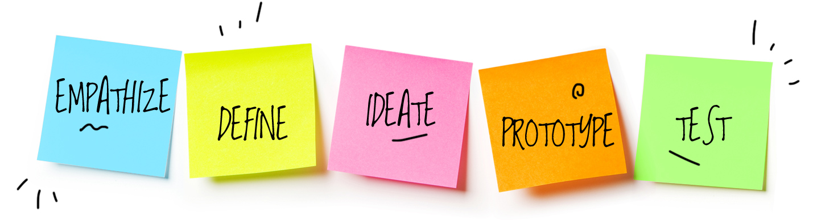
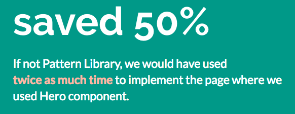
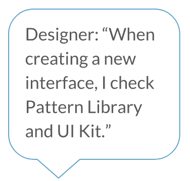
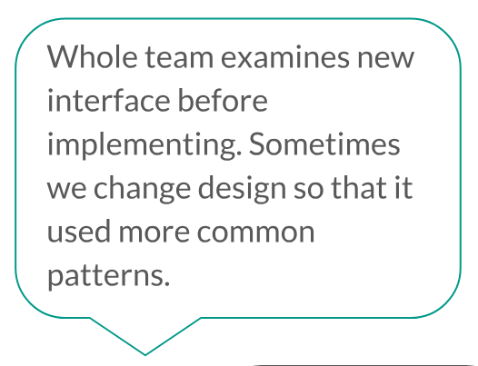
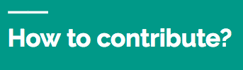
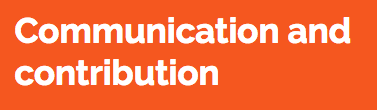

---

layout: ig

style: |

    #custom {
      background: black;
      padding-top: 0;
    }
    #custom h2 {
      color: yellow;
      margin-top: 70px;
    }

    .no-title h2 {
      display: none;
    }

    .code--size--m {
      font-size: 0.8em;
    }
    .slide .small {
      font-size: 50%;
    }
    .slide--shout h3 {
      color: #FFF;
      font-size: 4em;
      font-weight: bold;
      margin-top: 0.5em;
    }
---

# Building design systems that leverage your designers, developers and products {#cover}

Varya Stepanova 
Design Systems Specialist
{: .author }

<!--

-->

<!-- Picture credits: http://www.createmydreamlifestyle.com/index.php/2016/07/30/advantages-of-the-laptop-lifestyle/ -->

## Me
{: .no-title .about-me }

{: .photo }

### Now
Design Systems Specialist  at Intergalactico Nordcloud Design Studio

### Before
TMG (Amsterdam, the Netherlands); Yandex&nbsp;(Moscow,&nbsp;Russia)

### Area of expertise
Components on the web: design systems, pattern libraries, SGDD, BEM. Techs: CSS, JavaScript, etc.

<!--

My name is Varya, I have experience in development working in small to large projects across the
world. The things I have been doing are about frontend and most of the project was around something which is
currently called "design systems". In previous years, this activity had many different names like "pattern libraries",
"styleguides", "component approach", "atomic design".

Today I would like to focus on not technical aspects of design systems. Or precisely how to build and organize the
design system which takes into account your company situation, suits specific products and is useful for your teams.

-->

## Various design systems
{: .no-title }

{: .cover }

<!--

If you compare design systems of different comanies, it will be very visible how differently they approach the subject.

No wonder since as a concept design systems contain various subtopics. It's not possible and also not needed to have
this all. When buildign their design systems, the companies focus on what is more relevant for them.

Some implement libraries of components, some focus on visual guidelines, some focus on
processes. If they work in all these aspects, they still do it differently.

When applying the gain knowledge to your own design system (if you start or manage it), it's very difficult to find out
what path to follow. Just copying approaches of some public design system might not fit your organization and products.

-->

## Elisa 2018 journey
{: .no-title .elisa-2018 }

### Design system at
<object
    class="ea-logo"
    type="image/svg+xml"
    title="Elisa"
    data="http://static.elisa.fi/components/pattern-library/6.3.0/release/images/elisa-logo.svg#{$modifiers}"></object>
### in 2018

* Great design community
* World-class frontend teams
* UI kit in Sketch
* Library of CSS components
* Libraries of React components
* Shared tools and practices

<!-- TODO: represent it as  nice images -->

<!--

From the beginning of this year, I have been working on a design system for Elisa. Not from scratch. It aleady existed
and had all these artefacts.
It's a huge product which includes several UI libraries. Nor only CSS implementtaion but also more complex React logic.
There is a lot of patterns in each of them and there is a large UI kit in Sketch. Apart from technical perspecitive,
design system at Elisa means communication practises, visual guidelines, shared processes and tools.
By that time, it was already successful. We even proved this fact with feedback from our project teams and calculations
of cost savings.
But these artefacts of design system grew and so grew the workload. At the same time we were looking for how these all
can work together more smoothly and bring more value.
How do we aproach it?

-->

## What?
{: .what .no-title }

<h3 class="wtitle">
  How?
  What?
</h3>

<!--

The main question here was "what should we do?". According to my experience, it is often skipped. People start from "how
we do this?" meaning that the what is obvious. I myself did it dozens of times. And this "how" approach still leads to
good result. If you work hard, you will get something good. But can we do even better?

What if we consider a desgin system as a service within the organization? It is internal service but it still works
similarly to the services we provide for the company customers.
Then, similarly to designing a regular service, we do not skip this "what" part but invest a good research and ideation
into it.

When deciding what to do where is nothing obvious, it is territory of unknown.
IN the context of design systems, remembering this is very crusial. We all are designers or technical specialists. We
have a lot of assumptions about how the things should be done and what we have to do. We feel very confident about that
because we are professionals in the field.
But in fact, similarly to developing any other service, there is nothing obvious. It is very likely that the community
has differnt needs.
It is always good to focus on a bigger picture - "what are we here for?". In a bigger organisation, we are all together
to provide software products, to offer them for the company customers and so generate business value.

So, let's see WHAT we can do for this purpose.

-->

## Design thinking

{: .cover }

<!--

Image source: http://www.reply.com/en/design-thinking

Keeping in mind that there is nothong obvious, we decided to apply the design thinking approach and service design
methods.

-->

## Research

* Customer research
  - *interviews* with teams
  - documenting feedback
* Industry research
  - having time for studies

<!--

So we followed the classic design process which includes interviews in the focus group. For the design system case, our
focus group are the product teams which use UI kit and the libraries. We met all the teams and had conversation with
designers, developers and PO's. This way, we could get information from differnt perspectives. And it was very visible
how developers comment on technical aspects, designers give their feedback and share ideas on the design part and PO's
give us business perspetive.
We have typescripts of all these interviews. This is an important point because during the next phases we came back to
this infromation again and again. So it was very good to have it written.

Later, we also included other sourses of information such as documented feedback and information from public sources. We
used to work with feedback previously but the older ways was direct respond trying to serve the people in the best way.
Now we document everything we get and so raise our knowledge bank.

Besides, we are constrantly studying the situation around us, what other compaies do and what they share. We dedicate
time for such studies and often have a preliminary goal, what are the answers we are looking at.

-->

## Process the info
{: .process }

* What we are doing now
* What people expect us to do
* Our dream activities 
  *How would we respond the requests if we COULD.*
* What we can offer now

{: .pl }
{: .r }
{: .r2 }
{: .con }
{: .com }

<!--

After getting the raw data, we started to process it. Design thinking approach is cyclic, so that you go through the
stages again and again. So, neigther getting infromation nor processing it nor other steps are never "done". But I can
tell how it was at some iterations of it.

We were focusing yet on a low level and we planned how we could serve the direct requests
of the people.
After initial team interviews, we compared what we were doing with what people extected us to do. They wanted much more
and it was our dream to do this all. However, resources are always limited so that we developed more realistic plan.

Of course, it is possible to add the
resourses and extend the design system team for keeping this path. But I am grateful that we have tight resourses
because it helpped us to look at the bigger picture and focus on finding out how we can change this situation.

During this processing of information it became visible that the design system team and the project teams have different
perception of the situation. They requested a lot. Why? It was not the situation that they did not like what we have
done, the feedback about existing things was positive. But they still viewed the things which design system offers and
the role of the design system team a bit differently. We wanted to learn how much differently and so we run the
workshops.

-->

## Workshops
{: .workshops .no-title }

| | | | | |
| | | | | |
| | | | | |
{: .workshops--table .next }

<!--

Picture source: https://galleryhip.com/two-different-groups-of-people.html

We had two workshops with the help of Kauri Salonen. You could heard his talk at recent Design Systems Conference in
Helsinki or at some other events. He has a loud name and he was a huge help.

The approach he used was from DevOps. And actually it's very similar. When building design systems we are doing design
operations. So why not to use gained knowledge from DevOps area? This is what we applied in the workshops.

We had two session with two different groups. First group was the design system team. In the second group there were
representatives from the product teams. The two groups had independent workshops so that at the end we had different
results and an opportunity to compare them.

Each workshop was a discussion about ideal but realistic process to happen when recognizing a new pattern, designing and developing
it and then using at the products. Ideally it would be nice to have such a discussion about different scenarious like
fixinf a bug or changing a pattern used across the whole company, or changing brand. But it's not possible to discuss everything
in couple of hours, so we narrowed it down to just one question: what happens with a new pattern.

In the discussion, we outlined the stages of creating a new pattern from identifying the buisness need to delivering the
pattern to the company products. Then we had an image of the whole process from three different perspectives: what is
happening, who is making it happened and who they do it.

It turned out that we got very different results. This underlined the problem that there is informational gap around the
topic of desigin system.

Here I have to say that by metrics the situation is very good. There is a lot of products reusing the components. But we
found a place which we could inprove even with given resourses.

This made us focus on information availability for the design system.

-->

## Design system is a process
{: .new-process }

<!--

We decided that for us a desgin system is a process that benefits software products. We still have UI kit, the library
of components but they happen automatically whereas we are focused on keeping the process smooth.

-->

## Everyone to be involved
{: .involved }

<!--

Fishing rod not fishing

We want to have everyone involved. However, there is a paradox. Not everyone in the organization is interested in all
the aspects of design systems, and not everyone has knowledge how to make it. This is more than normal, we all have
different professional focuses. At the same time, the desgin system team want exactly these people to be involved
because they are the most close to the products and to the business cases.

So, stepping into the design system should be very smooth, the learning curve should not be steep. And it should be
possible to participate just a bit. Or to contribute very little, as much as a person can do at the moment.

-->

## Single point of truth
{: .website .no-title }

<!--

design.elisa.fi

-->

## Give and get

* Constantly growing site
  - Documentation
  - Announces
  - Tutorials and shares
  - Blog
* Channel in instant messenger
* Communication in person

<!--
How we make information available.
-->

## be creative
{: .slide--shout .slide--blue .no-title }

### be creative

## Pattern journey
{: .no-title .pattern-journey }

<iframe width="100%" height="100%" src="http://varya.me/design-systems/pattern-journey/#pattern-journey---interactive-scheme" frameborder="0" allow="autoplay; encrypted-media" allowfullscreen></iframe>

## be unique
{: .slide--shout .slide--pink .be-unique .no-title }

### be unique

## Thank you
{: .thanks }

Varya Stepanova, Intergalactico - Nordcloud Design Studio 
[@varya_en](https://twitter.com/varya_en){: .twitter }; on the web: [varya.me](http://varya.me){: .web }

### Slides

### [varya.me/ds-in-wild-tallinn](http://varya.me/ds-in-wild-tallinn/)

<!--
Thank you very much! You can always reach me out in twitter, or in the afterparty.
-->

