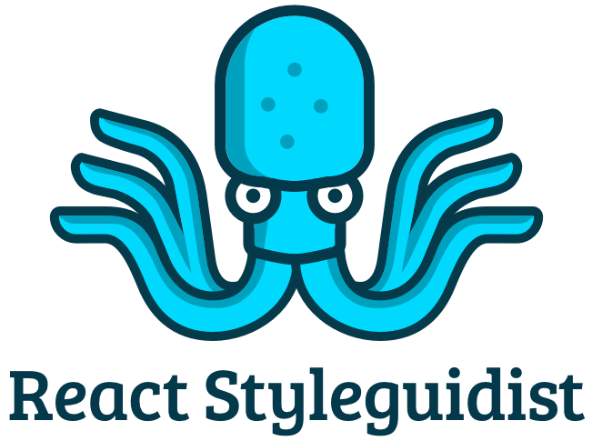
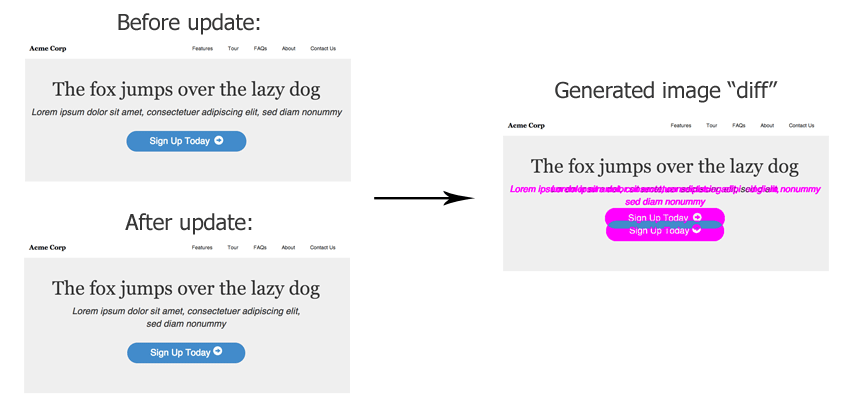

---

layout: ribbon

style: |

    #Cover h2 {
        margin:30px 0 0;
        color:#FFF;
        text-align:center;
        font-size:70px;
        }
    #Cover p {
        margin:10px 0 0;
        text-align:center;
        color:#FFF;
        font-style:italic;
        font-size:20px;
        }
        #Cover p a {
            color:#FFF;
            }
    #Picture h2 {
        color:#FFF;
        }
    #SeeMore h2 {
        font-size:100px
        }
    #SeeMore img {
        width:0.72em;
        height:0.72em;
        }

    .slide--center {
      text-align: center;
    }
    .slide--center .slide__content {
      text-align: justify;
    }
    .no-title h2 {
      display: none;
    }
---

# A practical guide to building your design system infrastructure {#Cover}

*Brought you by [Varya Stepanova](https://varya.me/) and generated by [Jekyller](https://github.com/shower/jekyller)*

{: .cover}
<!-- TODO: Change picture -->

<!--

Hello. Let's thank Andrey for a very comprehensive introduction to the design systems and explaning their value. My name
is Varya Stepanova and I am going to continue with the same topic. Since we are here at the React conference, I would
like to cover how we could apply React or even more generally speaking JavaScript to building design systems, providing
tooling for them, creating supplementary tools and measuring their success.

-->

## Design Systems <i>[in <b>React</b> world]</i>
{: .react-world .slide--center }

- …shared practises
- …tools
- …processes
- …community
{: .list }

<!--

In the context of React as technology, ecosystem and community, design systems are often mentioned as high-level
component libraries. This is indeed a huge aspect of them but a solid design system is never only a library.

Of course, many companies start from library and later have a very strong technical aspect of that. But sooner or later
we find out that design system is much more.

As it is yet evolving concept, our understanding of it is changing, so there is no definition. But speaking from
experience, I would say that a design system is

- shared practises 
  Shared practises, based on which you design your product or bunch of products under the same brand. Components go
  here, but this is not only about them. The practises can be more anstract or more design related such as visual
  language or tone of voice. Or on the contrary, they can be deeply technical and reflect your approach to code.
- tools 
  This brings us to tools which our company could have for all the developers and designers to share. As we are speaking
  about design systems as a way of standartizing, they fit there.
- processes 
  At some level, design systems would mean the processes which are followed in the company to achieve the outlined
  goals.
- community 
  Ans finally, working with our fellow developers, designers and project owners as with a community also resonates with
  design system goals.

Even though the components were only mentioned in the beginning, we can apply technologies to all of these aspects of
design systems.
In the following talk I will show examples of applying React, Gatsby and some other JavaScript buzzwords to a
design system. And it shuold help even non-React projects.

I would like to underline this. Even if there is nothing of React in some design system, it still can help.
For example, some companies stay with pure CSS/HTML libraries. But they also take advantage of the fancy
approaches from the conferences. And I am going to show this by examples.

Icons:

Icons made by <a href="http://www.freepik.com/" title="Freepik">Freepik</a> from <a href="https://www.flaticon.com/" 		    title="Flaticon">www.flaticon.com</a> is licensed by <a href="http://creativecommons.org/licenses/by/3.0/" 		    title="Creative Commons BY 3.0" target="_blank">CC 3.0 BY</a>

-->

## Design system at <b>Elisa</b>
{: .elisa }

<object
    class="ea-logo"
    type="image/svg+xml"
    title="Elisa"
    data="http://static.elisa.fi/components/pattern-library/6.3.0/release/images/elisa-logo.svg#{$modifiers}"></object>

* Great design community
* World-class front-end teams
* UI kit
* Library of CSS components
* Libraries of React components
* Shared tools and practices

<!--

The examples I will be giving are based on experience of working with design system at Elisa.

For those who are not from Finland or Estonia, Elisa is our local telecommunication operator and content provider with a
long history and dozens of digital products which are offered under the same brand.

It's a huge product which includes several UI libraries. Some libraries are in React but there is also a plain HTML/CSS
library which still needs a lot of automations and technological support.

Besides, there is a large UI kit in Sketch.

Apart from technical perspecitive,
design system at Elisa means communication practises, visual guidelines, shared processes and tools.

So, during the last year, I had a lot of opportunities to apply different technologies for supporting this ecosystems,
making processes smooth and more transparent.

-->

## React living styleguides
{: .living-styleguides .no-title }

{: .styleguidist }
{: .storybook }
<i class="whatever next">💁</i>

Scheme of generating docs
{: .next }

<!--

I think all of you are familiar with Styleguidist and Storybook. Or maybe some have experience with other similar
solutions. They provide nice isolation, help with styleguide-driven development and offer supplementary plugins for
different purposes. Such solutions are huge help when developing a React project or / in design systems context / a
library of React components.

But it is possible to use these tools also for plain HTML/CSS libraries as well.

What we need to enjoy Styleguidist or Storybook? We should have our code snippets in a special format. It is in markdown
for Styleguidist and in JavaScript for Storybook.
With our plain HTML/CSS library we usually also have similar documentation for components but maybe in different
formats. At Elisa, we had these snippets as comments in CSS code and there was a custom tool to parse those comments.

Then, if we want this documentation in React-friendly format, we can just translate it with some script. So, these
markdown files for Styleguidist or stories for Storybook can be generated automatically. And after that, we simply run
the tool over the gotten source.

This way, you don't have to change the way how you write your docs and you don't break the familiar process for your
people. But you already have Styleguidist in use.

Then, Styleguidist can be used as a playgorund for development or it can be customized as a documentation website.

Also, consider this automation as a small step towards new technologies. One day they will come to your project as well.
By that time you already have some set up for the tools.
-->

## Visual regression tests
{: .vr-tests }

## This is CSS
{: .no-title .this-is-css }

## Visual regression tests

Example of a command to run

<!--

Using standard and community-supported living style guide you can enjoy supplementary tools. For example, you can have
visual regression tests for your components quite nicely and without much pain.

I have a lot of experience with custom set ups. They served the purpose but took much more time to maintain. So, I think
it is always better to re-use the community work and adopt the common solution.

Both Styleguidist and Storybook have additional tools for visual regression tests, sometimes more than one. I did not
check recently if somthing new appeared but usually there is a variety to choose from. In general, it is usually a
package to unstall and then run a command. That simple.

Combining this idea with generating stories, you can take advantage of the plugins even for non-React projects. This is
not only about visual tests. If we generalize the idea, we can think about using React ecosystem for non-React projects.
-->

## Design systme website

### Gatsby

<!--

Now, let's come back to the idea that a design system is not only the library of components. Having a generated
styleguide is nice but most likely we will need something more.

As a developer using a design system, I would like to have access to release notes, maybe some general documentation
about the system, not only about components separately.
As a designer, I also want to be involved, and have not so much tenhnical but design-focused information.
As a project manager or owner, I need shrinked prepresentation but more information about the upcoming content in the
design system, their roadmap and such plans.
And all together we would like to have soemthing which helps us as multidisciplinary team.
If there are several teams as usually happens in large orhanizations, we need an environment to collaborate more
effectively.
And as a business person, I would like to have a larger scale picture, maybe even with numbers of how much we earn or
save.

So, the role of a design system is to connect all those people and create environment for efficient collaboration.
Design system itself is "Single Point of Thurth", a place, a tool a thing which communicates you how to build and
maintain the products. This single point of truth needs proper representation, something real, from where we get the
info.

A styleguide website which documents the components cannot be such a place but only a part of it. Design
system is not only a library, also a visual language. On the most high level, it is processes and community work.
All these aspects have to be documented. Obvious respond to such a need is to implement a website. It is also can be
interactive and provide tools and scenarios for its own evolving, it is even better.

At the same time, it's good to automate as much as possible. So, it dictates the technical solution behind the website.
It can be whatever you as a developer is comfortable with. My own experience was with GatsbyJS and I found out a lot of
nice things about it applicable to building a design system website. Gatsby has a lot of plugins and it is quite easy to
write your owns. So, it is very flexible and can easily respond your organization needs. I can show you some things I
implemented with it, but beware there is no limits.
-->

## Basic structure

Gatsby structure

<!--

Just to put you into context, this is a source structure of Gatsby website I was workinng with. Basically, the website
had a structure of pages and one of the sections is blog. The content is stored in markdown files in the very same
repository as Gatsby configuration and processing code. Gatsby does not dictate the source to be in markdown, on the
contrary, thanks to its flexibility it can be whatever database or whatever file format. But for a quick start, it was
super easy for me to have it in markdown.
You do not see anything about components here because the styleguides of all the mentioned libraries are hosted on
separate servers and domains. But this website has links to them, and so naavigation goes smooth for a user. Again,
technically nothing prevents you from displaying the components and their documentation right here. It is just a matter
of time and resources you have.

-->

## Inserting React components into markdown in Gatsby

<!--

Even though, storing in markdown sounds very tehcnical and probably not so much welcomming to a design aspect, thanks to
Gatsby flexibility, it turns out to be useful. For example, with one of the plugins you can 
insert React compnents into markdown, and they will be rendered. This way you
can get React components from your library and describe them in a very flexible way on pages. A designer can write a
text an illustrate it with the component. Even if your components are not in React but let's say in plain HTML/CSS, you
still can provide generic React interface for them, similar to how it was done for usign Styleguidist or Storybook.
This will simplify writing the documentation and also smoothly teach non-React people how beuatiful React is.
Constrantly, they shift their mind from HTML snippets to React tags, and this will help with adopting the technology all
over the company, if you need this.

-->

## Welcome to edit the markdown source

<!--

We are already speaking about community and contribution. There are different governance models for design systems.
Sometimmes there is a dedicated team for its development, sometimes the whole process goes spontaniously. But in all the
cases community work is welcomed. It does not have to be coding or designing. Contribution to documentation or sharing
the ideas is also very crucial. At the end of the day, no one else but design system users know it from users'
perspective.

In order to involve the community into the Design System project, give them as much way to contribute as possible. Here
again the Gatsby choice and hosting the source on GitHub helps a lot. It can be GitHub Entreprise, but with access for
all the employees.

We allow people to propose their text or code changes. If it is via GitHub pull requests, it is quite safe as still is
reviewed by the team. But very important that all the colleagues, anyone of them feels a bit as an owner of the project.
Smart books call it "emotional ownership", so don't skip this aspect.

There is a bit of learning curve for non-technical people here. But not so large, they don't have to make any fork. Just
provide a link to editting via GitHub interface and it's done. The pull requests can come as patches.

This definetely speeds up the process, plays a large role in keeping the docs up-to-date and in general makes the design
system *alive*.

-->

## Gather all the contributor names from GitHub

<!--

And a little tip here. If everything is editted with GitHub, we can alanyze the source history and get the names of all
the contributors. It pays respect for people's work and I'm sure it is very pleasing to see yourself in the list.

Secondary, it helps
people to communicate. They can see whom to ask about specific things.
-->

## Use different sources (e.g. Wordpress) to make blogging culture

<!--

If makrdown sounds too technical and not so much welcoming, you can use other sources. For example, not everyone finds
blogging experience nice with Makrdown. Then, you can offer them faniliar solution, maywe Wordpress? With Gatsby, you
can get data from there and still represent it on the website. This way, Wordpress acts like CMS. If it destroys
barriers, then it's definitely a solution to go.
-->

## Extract md of dependent packages and turn into Gatsby pages

<!--
The design system website as "single point of truth". Design system itself is single point of truth, so should be the
website about it. All the information has to be gathered together, it also smooths the learning curve. Technically you
can install the libraries packages as dependencies and import their markdown docs into website pages. TODO: refer to
remark plugin for importing.
-->

## Custom React components

<!--
Besides, you can make custom components. They are not from your library but whatever else. Here only your fantacy can
limit you. This way you create interactive documentation. Here are some examples from my experience:
* Pattern Journey
* Changelog (but later we did it differently)
* Cartoon about flow
-->

## Interactive changelog?

<!--
Similarly, we can get changelogs of the libraries. In GitHub they are stored as static pieces of text which is not super
convinient when our fellow developers want to upgrade through many versions. We can improve GitHub flow and based on the
extracted data make some kind of interactive changelog. This again smooths the learning curve and makes things easier
for the people (one of the most important things in design systes, because it's a service!).
-->

## Crawling the repositories to calculate the usage of components

<!--
This is more about measuring the impact of design systems, which is another huge topic. BTW, I am very much in it right
now and if you would like to have a chat about it, please welcome to speak after the talk or in social networks. But
again, from automation perrspective, if all the projects are in some repositories, let's say on GitHub Enterprise, wee
can crawl repos and calculate the usage of components. Works for React components and for re-use of CSS classes.
Similarly, we analyse dependencies in `package.json` at the projects and so we can learn the versions used.
-->

## Build charts based on gathered knowledge

<!--
Most metrics cannot show much on their own but are more valuable in dynamics. As design system is usually not a solid
product but constansly evolving thing (I would even say it's a process), we would like to "measure" that we are doing
better not worse. For a human being, it's much more readable as a chart of graph. So, we can store gathered information
and represent it on the weebsite as a chart component. TODO: Give examples.
-->

## Design systems as a service

<!--
Design systems are very new concept, so shape it to your own project. Use design thinking and user centred design

As I mentioned, design system is a service and when providing tooling around it, you should consider your fellow
developers and the users. Service design offers methods to develop new ideas and sharp the services for the users. Like,
user-centred design etc. The ideas presenetd above were very much developed based on propoper user research which I made
with my colleagues on existing design system. Usign similar methods, you can develop your own ideas or combine with the
presented and shape your design system up to the needs of your company and projects.
-->

## Thank you
