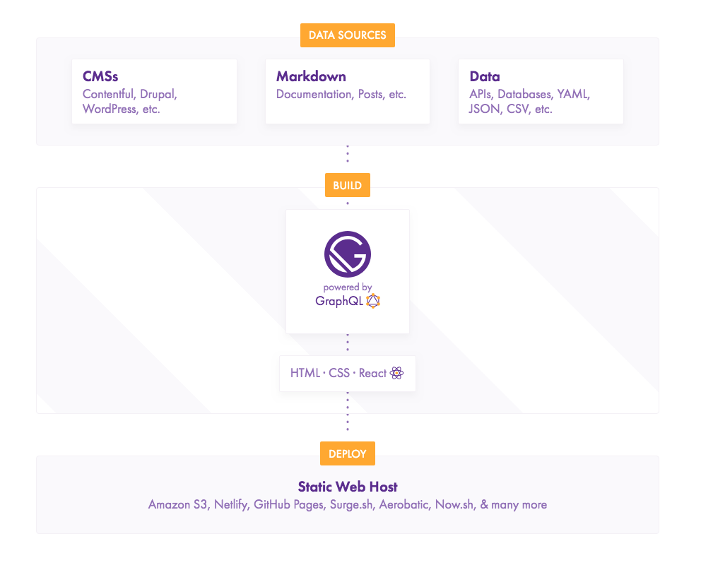
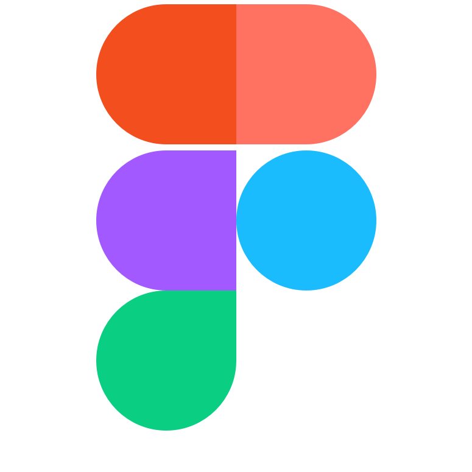
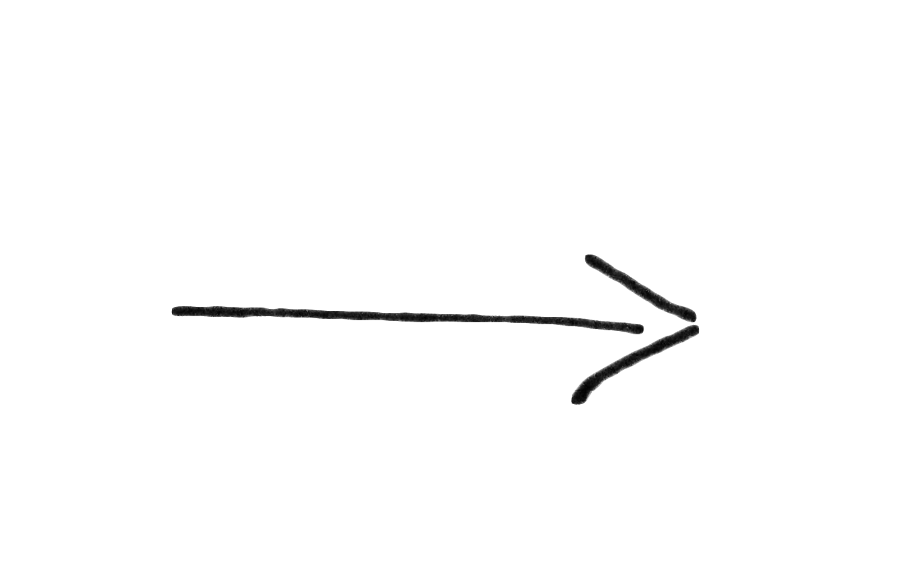

---

layout: ribbon

style: |

    #Cover h2 {
        margin:30px 0 0;
        color:#FFF;
        text-align:center;
        font-size:70px;
        }
    #Cover p {
        margin:10px 0 0;
        text-align:center;
        font-size:20px;
        }
    #Picture h2 {
        color:#FFF;
        }
    #SeeMore h2 {
        font-size:100px
        }
    #SeeMore img {
        width:0.72em;
        height:0.72em;
        }


    .slide--center {
      text-align: center;
    }
    .slide--center .slide__content {
      text-align: justify;
    }
    .no-title h2 {
      display: none;
    }
---

# <span class="guide">A practical guide</span> <span class="building">to&nbsp;building your</span> <span class="ds-infrastructure">design&nbsp;system&nbsp;infrastructure</span> {#Cover}

<marquee class="conveyor" direction="right">
<div markdown="1">

**line**
{: .svg .image .image--1 }
**line**
{: .svg .image .image--2 }
**line**
{: .svg .image .image--3 }
**line**
{: .svg .image .image--4 }
**line**
{: .svg .image .image--5 }
**line**
{: .svg .image .image--6 }
**line**
{: .svg .image .image--7 }
**line**
{: .svg .image .image--8 }
**line**
{: .svg .image .image--9 }
**line**

</div>
</marquee>

<b>Varya Stepanova</b>, Design Systems Expert / [varya.me](http://varya.me)
{: .author }

<script>

var conveyor = document.getElementsByTagName('marquee')[0];
var conveyor2 = conveyor.cloneNode(true);
setTimeout(function() { conveyor.parentNode.appendChild(conveyor2) }, 14800);

</script>

<style>

#Cover {
  padding-left: 60px;
  padding-right: 60px;
}

#Cover,
#Cover h2,
#Cover p
 {
  color: black;
}

#Cover h2 {
  font-size: 55px;
  margin-top: 0.25em;
  line-height: 1em;
  text-transform: capitalize;
}

#Cover h2 .guide {
  display: block;
}

#Cover h2 .building {
  font-size: 40px;
  font-family: "Graphik Light";
  display: block;
  text-transform: uppercase;
  margin-top: 0.25em;
}

#Cover .conveyor {
  position: absolute;
  left: 0;
  top: 300px;
  white-space: nowrap;
  height: 225px;
}

#Cover .conveyor strong {
  font: 0/0 a;
  height:  3px;
  width: 20px;
  background-color: black;
  margin-left: -6px;
  line-height: 7px;
  color: transparent;
  display: inline-block;
}

#Cover .image {
  width: 100px;
}

#Cover .image--1 {
  margin-left: -6px;
}

#Cover .image--2 {
  margin-left: -9px;
  margin-bottom: -87px;
}

#Cover .image--3 {
  margin-left: -6px;
}

#Cover .image--4 {
  margin-left: -6px;
  margin-bottom: -35px
}

#Cover .image--5 {
  margin-left: -6px;
  margin-bottom: -5px;
}

#Cover .image--6 {
  margin-left: -9px;
  margin-bottom: -87px;
}

#Cover .image--7 {
  margin-left: -9px;
  margin-right: -6px;
}

#Cover .image--8 {
  margin-left: -13px;
  margin-bottom: -97px;
}

#Cover .image--9 {
  margin-left: -6px;
  margin-bottom: -14px;
  margin-right: -2px;
}

#Cover .author {
  margin-top: 275px;
  text-align: right;
}

</style>

<!--

Hello. Let's thank Andrey for a very comprehensive introduction to the design systems and explaning their value. My name
is Varya and I am going to continue with the same topic. Since we are here at the React conference, I would
like to cover how we could apply React or even more generally speaking JavaScript to building design systems, providing
tooling for them, creating supplementary tools and measuring their success.

-->

## Me
{: .no-title .about-me }

{: .photo }

### Varya Stepanova
<b>Expert in Design Systems</b><br/>
<small>Frontend enginner, service designer</small>

#### Contacts
* [@varya_en](https://twitter.com/varya_en){: .twitter }
* [varya.me](http://varya.me){: .web }
* [mail@varya.me](mailto:mail@varya.me)
{: .contacts }

#### Areas of expertise
Design systems: production and governance,<br/>pattern libraries, style guides, UI/UX, front end.

<style>
.about-me p {
  font-size: 80%;
}
.about-me .photo {
  float: left;
  width: 300px;
  margin-top: 1em;
  margin-bottom: 6em;
  margin-right: 1em;
  border-radius: 50%;
}

.about-me h4 {
  color: #ca4e1f;
  font: 1em/1 'FF Meta Serif',sans-serif;
  margin-bottom: .5em;
}
.about-me b {
  font-size: 1.25em;
}

.about-me .contacts {
  line-height: 1;
  font-size: 0.8em;
}
.about-me .contacts li:before {
  content: '';
}

.about-me .twitter
{
  text-decoration: none;
  color: currentColor;
  background: none;
  border-bottom: 0;
}
.about-me .twitter::before
{
  content: "";
  display: inline-block;
  width: 1.5em;
  height: 1.5em;
  background-image:url('pictures/twitter-logo.png');
  background-size: cover;
  margin-right: 0.5em;
  margin-bottom: -0.5em;
}
</style>

<!--

First, a few words about myself. Design Systems has been my major focus even before the buzzword appeared. I have over
10 years of experience in frontend development, mostly doing the things related to the components on the web. Back then
it was CSS and JavaScript technologies for component production, later styleguides and pattern libraries, and nowadays
finally design systems. I worked on technical aspects of design systems in several projects and also did a lot of
oranizational work, technical evangelism and design system leadership. At the moment, I am self-employed expert in
design systems. I started my own consultancy and hope to be a help for the projects which need it.

-->

## Design Systems <i>[in <b>React</b> world]</i>
{: .react-world .slide--center }

- …shared practises
- …tools
- …processes
- …community
{: .list }

<style>

.react-world h2 i {
  color: #000;
  font-style: normal;
  text-transform: none;
}

.react-world h2 i b {
  color: #61DAFB;
  font-family: -apple-system,BlinkMacSystemFont,Segoe UI,Roboto,Oxygen,Ubuntu,Cantarell,Fira Sans,Droid Sans,Helvetica
  Neue,sans-serif;
}

.react-world .svg {
  margin: 50px 100px;
}

.react-world .list {
  position: relative;
  margin-left: 50%;
  margin-top: 4em;
}

.react-world .list li.current {
  font-family: 'Graphik Medium';
}

.react-world .list li:after {
  position: fixed;
  top: 50%;
  left: 25%;
  width: 200px;
  margin-top: -100px;
  margin-left: -50px;
  display: none;
}

.react-world .list li.current:after {
  display: block;
}

.react-world .list li:nth-child(1):after {
  content: url('pictures/icons/web-design/042-solution.svg');
}
.react-world .list li:nth-child(2):after {
  content: url('pictures/icons/web-design/029-settings.svg');
}
.react-world .list li:nth-child(3):after {
  content: url('pictures/icons/user-experience/040-algorithm.svg');
}
.react-world .list li:nth-child(4):after {
  content: url('pictures/icons/web-design/039-sharing.svg');
}
</style>

<!--

Now, let's define once again what design systems are.

In the context of React as technology, ecosystem and community, design systems are often mentioned as high-level
component libraries. This is indeed a huge aspect of them but a solid design system is never only a library.

Of course, many companies start from library and later have a very strong technical aspect of that. But sooner or later
we find out that design system is much more.

As it is yet evolving concept, our understanding of it is changing, so there is no definition. But speaking from
experience, I would say that a design system is

  - Shared practises, based on which you design your product or bunch of products under the same brand. Components go
  here, but this is not only about them. The practises can be more abstract or more design related such as visual
  language or tone of voice. Or on the contrary, they can be deeply technical and reflect your approach to code.
  - This brings us to tools which our company could have for all the developers and designers to share. As we are speaking
  about design systems as a way of standartizing, they fit there.
  - At some level, design systems would mean the processes which are followed in the company to achieve the outlined
  goals.
  - Finally, working with our fellow developers, designers and project owners as with a community also resonates with
  design system goals.

Even though the components were only mentioned in the beginning, we can apply technologies to all of these aspects of
design systems.
In the following talk I will show examples of applying React, Gatsby and some other JavaScript buzzwords to a
design system. And it should help even non-React projects.

I would like to underline this. Even if there is nothing of React in some design system, it still can help.
For example, some companies stay with pure CSS/HTML libraries. But they also take advantage of the fancy
approaches from the conferences. And I am going to show this by examples.

-->


## Design system at <b>Elisa</b>
{: .elisa }

<object
    class="ea-logo"
    type="image/svg+xml"
    title="Elisa"
    data="http://static.elisa.fi/components/pattern-library/6.3.0/release/images/elisa-logo.svg#{$modifiers}"></object>

* Great design community
* World-class front-end teams
* UI kit
* Library of CSS components
* Libraries of React components
* Shared tools and practices

<style>

.elisa .ea-logo {
  position: fixed;
  top: 45px;
  left: 550px;
}

.elisa h2 {
   display: inline-block;
}

.elisa h2 b {
  display: none;
}

.ea-logo {
  width: 200px;
  height: 80px;
  margin: 0 15px -15px;
}

</style>

<!--

The examples and ideas I will be giving are based on experience of working with design system at Elisa.

For those who are not from Finland or Estonia, Elisa is our local telecommunication operator and content provider with a
long history and dozens of digital products which are offered under the same brand.

Elisa Design System a huge product which includes several UI libraries. Some libraries are in React but there is also
a plain HTML/CSS library which still needs a lot of automations and technological support.

Besides, there is a large UI kit in Sketch.

Apart from technical perspecitive,
design system at Elisa means communication practises, visual guidelines, shared processes and tools.

So, during the last year, I had a lot of opportunities to apply different technologies for supporting this ecosystems,
making processes smooth and more transparent.

-->


## To react or not to react?
{: .react-or-no .slide--shout .slide--primary }

{: .svg .image }

<style>
.react-or-no .image {
  width: 250px;
}
</style>

<!--

As I said, a part of the product was a plain CSS/HTMl library which seems to be not related to the topic of React. But
let's have a closer look.

-->


## React living styleguides
{: .living-styleguides }

{: .styleguidist }<br/>
{: .storybook }<br/>
<i class="whatever next">💁</i>

<style>

.living-styleguides {
  text-align: center;
}

.living-styleguides .styleguidist,
.living-styleguides .storybook {
  width: 230px;
}

.living-styleguides .whatever {
  display: inline-block;
  font-size: 120px;
  font-style: normal;
}

</style>

<!--

I think all of you are familiar with Styleguidist and Storybook. Or maybe some have experience with other similar
solutions. They provide nice isolation, help with styleguide-driven development and offer supplementary plugins for
different purposes. Such solutions are huge help when developing a React project or / in design systems context / a
library of React components.

But it is possible to use these tools also for plain HTML/CSS libraries as well?

-->


## React for non-React
{: .slide--center .react4non-react }

* Parse code snippets
* Reactify
  ```
  <button class="myButton">
  <button className="myButton" />
  ```
  {: .code }
* Create stories
* <b>Automate</b>
{: .list }

<style>

.react4non-react .slide__content {
  text-align: center;
}

.react4non-react .list {
  text-align: left;
  margin: 0 auto;
  width: 500px;
}

</style>

<!--

What we need to enjoy Styleguidist or Storybook? We should have our code snippets in a special format. It is in markdown
for Styleguidist and in JavaScript for Storybook.
With our plain HTML/CSS library we usually also have similar documentation for components but maybe in different
formats. At Elisa, we had these snippets as comments in CSS code and there was a custom tool to parse those comments.

Then, if we want this documentation in React-friendly format, we can just translate it with some script. So, these
markdown files for Styleguidist or stories for Storybook can be generated automatically. And after that, we simply run
the tool over the gotten source.

This way, you don't have to change the way how you write your docs and you don't break the familiar process for your
people. But you already have Styleguidist in use.

Then, Styleguidist can be used as a playgorund for development or it can be customized as a documentation website.

Also, consider this automation as a small step towards new technologies. One day they will come to your project as well.
By that time you already have some set up for the tools.
-->


## Designers update libs
{: .designers-update-libs .no-title .slide--center }

<blockquote class="twitter-tweet" data-lang="en"><p lang="en" dir="ltr">Designers updating their design libraries 🥵 <a href="https://t.co/ojFRhj8Smo">https://t.co/ojFRhj8Smo</a></p>&mdash; Alex 🌚 (@alexmuench) <a href="https://twitter.com/alexmuench/status/1111297292215246850?ref_src=twsrc%5Etfw">March 28, 2019</a></blockquote>
<script async src="https://platform.twitter.com/widgets.js" charset="utf-8"></script>

<style>

.designers-update-libs .slide__content {
  text-align: center;
}

.designers-update-libs twitter-widget {
  transform: scale(0.75) translateY(-125px) !important;
  margin: 0 auto !important;
}

</style>


## Why React?
{: .why-react }

* Development playground
* Autogenerated docs
* **Plugins**


## Visual regression tests
{: .vr-tests }


<style>
.vr-tests {
  text-align: center;
}
</style>


## This is CSS
{: .no-title .this-is-css }

{: .meme}

<style>
.this-is-css {
  text-align: center;
}
.this-is-css .meme {
  height: 500px;
}
</style>


## Visual regression tests
{: .slide--center }


<!--

Using standard and community-supported living style guide you can enjoy supplementary tools. For example, you can have
visual regression tests for your components quite nicely and without much pain.

I have a lot of experience with custom set ups. They served the purpose but took much more time to maintain. So, I think
it is always better to re-use the community work and adopt the common solution.

Both Styleguidist and Storybook have additional tools for visual regression tests, sometimes more than one. I did not
check recently if somthing new appeared but usually there is a variety to choose from. In general, it is usually a
package to unstall and then run a command. That simple.

Combining this idea with generating stories, you can take advantage of the plugins even for non-React projects. This is
not only about visual tests. If we generalize the idea, we can think about using React ecosystem for non-React projects.
-->


## Style Guide <b>vs</b> Design System
{: .style-guide_design-system .slide--shout .slide--primary-light }

{: .svg .image }

<style>
.style-guide_design-system b {
  text-transform: lowercase;
}

.style-guide_design-system .image {
  width: 250px;
}
</style>


## What is it for me?
{: .slide--center }

<div class="triple" markdown="1">

{: .svg .role--developer }

* Release notes
* Documentation
{: .next }

{: .svg .role--designer }

* Tone of voice
* Design specs
{: .next }

{: .svg .role--manager }

* Strategy
* Roadmap
{: .next }

</div>

<!--
<div>Icons made by <a href="https://creativemarket.com/eucalyp" title="Eucalyp">Eucalyp</a> from <a href="https://www.flaticon.com/" 		    title="Flaticon">www.flaticon.com</a> is licensed by <a href="http://creativecommons.org/licenses/by/3.0/" 		    title="Creative Commons BY 3.0" target="_blank">CC 3.0 BY</a></div>
-->

<!--

Now, let's come back to the idea that a design system is not only the library of components. Having a generated
styleguide is nice but most likely we will need something more.

As a developer using a design system, I would like to have access to release notes, maybe some general documentation
about the system, not only about components separately.
As a designer, I also want to be involved, and have not so much tenhnical but design-focused information.
As a project manager or owner, I need shrinked prepresentation but more information about the upcoming content in the
design system, their roadmap and such plans.
And all together we would like to have soemthing which helps us as multidisciplinary team.
If there are several teams as usually happens in large orhanizations, we need an environment to collaborate more
effectively.
And as a business person, I would like to have a larger scale picture, maybe even with numbers of how much we earn or
save.

So, the role of a design system is to connect all those people and create environment for efficient collaboration.
Design system itself is "Single Point of Thurth", a place, a tool a thing which communicates you how to build and
maintain the products. This single point of truth needs proper representation, something real, from where we get the
info.
-->


## Design system website
{: .ds-website .slide--center }

* patterns
* visual language
* processes
* community
* design tokens
* notes
* design principles
* documentation
* guidelines
* naming conventions
* brand
* vocabulary
* changelog
{: .tag-cloud }

{: .gatsby-logo .next }

<style>

.ds-website .slide__content {
  text-align: center;
}

.ds-website .tag-cloud {
  display: inline;
  list-style-type: none;
  width: 400px;
}

.ds-website .tag-cloud li {
  list-style: none;
  display: inline;
}
.ds-website .tag-cloud li:before {
  display: none;
}

.ds-website .tag-cloud li:nth-of-type(3n + 1) {
    font-size: 1.5em;
}
.ds-website .tag-cloud li:nth-of-type(4n+3) {
    font-size: 2em;
}
.ds-website .tag-cloud li:nth-of-type(5n - 3) {
    font-size: 1.25em;
}

.ds-website .gatsby-logo {
  width: 400px;
}

</style>

<!--
A styleguide website which documents the components cannot be such a place but only a part of it. Design
system is not only a library, also a visual language. On the most high level, it is processes and community work.
All these aspects have to be documented. Obvious respond to such a need is to implement a website. It is also can be
interactive and provide tools and scenarios for its own evolving, it is even better.

At the same time, it's good to automate as much as possible. So, it dictates the technical solution behind the website.
It can be whatever you as a developer is comfortable with. My own experience was with GatsbyJS and I found out a lot of
nice things about it applicable to building a design system website. Gatsby has a lot of plugins and it is quite easy to
write your owns. So, it is very flexible and can easily respond your organization needs. I can show you some things I
implemented with it, but beware there is no limits.
-->


## How Gatsby works
{: .gatsby-basics .slide--full-image }

{: .schema }

Credits: Robert Ngo, [Decoupling Drupal with Gatsby](https://evolvingweb.ca/blog/decoupling-drupal-gatsby)
{: .credits }

<style>

.gatsby-basics .schema {
  height: 100%;
}

.gatsby-basics .credits {
  transform: rotate(-90deg) translateY(475px);
  font-size: 0.75em;
  color: grey;
}

</style>

<!--

Just to put you into context, this is a source structure of Gatsby website I was workinng with. Basically, the website
had a structure of pages and one of the sections is blog. The content is stored in markdown files in the very same
repository as Gatsby configuration and processing code. Gatsby does not dictate the source to be in markdown, on the
contrary, thanks to its flexibility it can be whatever database or whatever file format. But for a quick start, it was
super easy for me to have it in markdown.

-->

## Design system website
{: .ds-website-structure }

### example of structure
{: .subtitle }

<div class="double" markdown="1">

```
content/
  pages/
    docs/
    about/
      team/index.md
      workflow/index.md
      index.md
  posts/
    welcome-to-new-ds-website/
      index.md
      thumb.png
```
{: .file-structure }

* Home
* Docs
* Style Guide
* Blog
* About

</div>

<style>

.ds-website-structure .file-structure code {
  line-height: 1.5em;
  font-size: 0.75em;
}

</style>

<!--

TODO: describe the structure

You do not see anything about components here because the styleguides of all the mentioned libraries are hosted on
separate servers and domains. But this website has links to them, and so naavigation goes smooth for a user. Again,
technically nothing prevents you from displaying the components and their documentation right here. It is just a matter
of time and resources you have.
-->


## Little bit more
{: .little-bit-more .slide--shout .slide--highlighted }

{: .svg .image }

<style>
.little-bit-more .image {
  width: 250px;
}
</style>


## React components in texts
{: .react-in-markdown }

<div class="double" markdown="1">

components/BodyText.js
```
const renderAst = new rehypeReact({
  createElement: React.createElement,
  components: {
    <mark class="important">'comp-my-button': MyButton,</mark>
  },
}).Compiler;
```
{: .code }

pages/my-page/index.md
```
title: Title of your page
---
Page text and living
<mark class="important"><comp-my-button></comp-my-button></mark>.
```
{: .code }

</div>

<style>

.react-in-markdown .double {
  margin-right: -2em;
  column-rule: 1px solid lightgrey;
}

.react-in-markdown .code {
  font-size: 0.75em;
}

</style>

<!--

Even though, storing in markdown sounds very tehcnical and probably not so much welcomming to a design aspect, thanks to
Gatsby flexibility, it turns out to be useful. For example, with one of the plugins you can 
insert React compnents into markdown, and they will be rendered. This way you
can get React components from your library and describe them in a very flexible way on pages. A designer can write a
text an illustrate it with the component. Even if your components are not in React but let's say in plain HTML/CSS, you
still can provide generic React interface for them, similar to how it was done for usign Styleguidist or Storybook.
This will simplify writing the documentation and also smoothly teach non-React people how beuatiful React is.
Constrantly, they shift their mind from HTML snippets to React tags, and this will help with adopting the technology all
over the company, if you need this.

-->


## Welcome to contribute
{: .contribute .reward }

### Input

```
<input placeholder="Placeholder Text"
    class="input" type="text" value="" />
```
{: .code }

Text inputs are accompanied by a label and wrapped inside a fieldset. The :hover and :focus styles follow our brand
colors.

[Edit this page on GitHub](){: .edit }


<!--

We are already speaking about community and contribution. There are different governance models for design systems.
Sometimmes there is a dedicated team for its development, sometimes the whole process goes spontaniously. But in all the
cases community work is welcomed. It does not have to be coding or designing. Contribution to documentation or sharing
the ideas is also very crucial. At the end of the day, no one else but design system users know it from users'
perspective.

In order to involve the community into the Design System project, give them as much way to contribute as possible. Here
again the Gatsby choice and hosting the source on GitHub helps a lot. It can be GitHub Entreprise, but with access for
all the employees.

We allow people to propose their text or code changes. If it is via GitHub pull requests, it is quite safe as still is
reviewed by the team. But very important that all the colleagues, anyone of them feels a bit as an owner of the project.
Smart books call it "emotional ownership", so don't skip this aspect.

There is a bit of learning curve for non-technical people here. But not so large, they don't have to make any fork. Just
provide a link to editting via GitHub interface and it's done. The pull requests can come as patches.

This definetely speeds up the process, plays a large role in keeping the docs up-to-date and in general makes the design
system *alive*.

-->


## Reward the contributors
{: .reward }

### Input

25.04.2019 · Contributors
<i class="github-userpic github-userpic--freiksenet"></i>
<i class="github-userpic github-userpic--saravieira"></i>
<i class="github-userpic github-userpic--bebraw"></i>

```
<input placeholder="Placeholder Text"
    class="input" type="text" value="" />
```
{: .code }

Text inputs are accompanied by a label and wrapped inside a fieldset. The :hover and :focus styles follow our brand
colors.

[Edit this page on GitHub](){: .edit }

<style>

.reward .slide__content {
  border: grey 1px solid;
  padding: 1em 1em 0;
  font-size: 0.75em;
}

.reward .code {
  background-color: black;
  color: lightyellow;
  padding: 1em;
  font-size: 0.8em;
}

.reward .github-userpic {
  display: inline-block;
  width: 30px;
  height: 30px;
  border-radius: 50%;
  background-size: cover;
  vertical-align: middle;
  margin: 0 0.125em;
  margin-top: -0.25em;
}

.reward .github-userpic--bebraw {
  background-image: url(https://avatars3.githubusercontent.com/u/166921?s=460&v=4);
}

.reward .github-userpic--freiksenet {
  background-image: url(https://avatars0.githubusercontent.com/u/172936?s=460&v=4);
}

.reward .github-userpic--saravieira {
  background-image: url(https://avatars0.githubusercontent.com/u/1051509?s=460&v=4);
}

.reward .edit {
  color: black;
  background-color: lightgrey;
  background-image: none;
  display: inline-block;
  padding: 0 0.5em 0 1em;
  font-size: 0.8em;
  position: relative;
}

.reward .edit:after {
  display: block;
  content: '';
  border-top: 1em solid transparent;
  border-bottom: 1em solid lightgrey; /* 40px height (20+20) */
  border-left: 1em solid lightgrey;
  position: absolute;
  top: 0;
  right: -1em;
}

</style>

<!--

And a little tip here. If everything is editted with GitHub, we can alanyze the source history and get the names of all
the contributors. It pays respect for people's work and I'm sure it is very pleasing to see yourself in the list.

Secondary, it helps
people to communicate. They can see whom to ask about specific things.
-->


## Share information
{: .blogging }

<blockquote class="twitter-tweet" data-lang="fi"><p lang="en" dir="ltr">Most design problems are really people problems.</p>&mdash; zeldman (@zeldman) <a href="https://twitter.com/zeldman/status/1112840913636745216?ref_src=twsrc%5Etfw">1. huhtikuuta 2019</a></blockquote>
<script async src="https://platform.twitter.com/widgets.js" charset="utf-8"></script>

### Blogging
{: .next .list-title }

* Announcements
* Plans and strategies
* Involving the community
* <b>Everyone takes stage</b>
{: .next .list }

<style>

.blogging twitter-widget {
  transform: scale(0.75) translateY(-125px) !important;
  display: inline !important;
}

.blogging .list-title {
  transform: rotate(270deg) translateX(195px) translateY(-385px);
  font-size: 1.5em;
}

.blogging .list {
  margin-left: 2.5em;
  margin-top: -1em;
}

</style>

## Cherish in-house blogging
{: .sources }

<div class="container" markdown="1">

{: .source .source1 }
{: .source .source2 }
{: .source .source3 }
{: .source .source4 }
{: .source .source5 }
{: .source .source6 }
<div class="source source__fade"></div>
{: .source .source--last }

</div>

{: .arrow }
{: .graphql }
{: .arrow }
{: .gatsby }
{: .schema }

### Give familiar interface

People are not used to writing markdown and edit files on GitHub?
Offer them <b>Wordpress as a source</b> for your design system website blog.

<style>

.source .slide__container {
  text-align: center;
}

.sources .container {
  position: relative;
}
.sources .source {
  width: 150px;
  margin-top: 15px;
  position: absolute;
  top: 0;
  left: 0;
  animation-name: SourceLogo;
  animation-duration: 3s;
  opacity:0;
}

@-webkit-keyframes SourceLogo {
  0% {
    opacity: 0;
  }
  50% {
    opacity: 1;
  }
  100% {
    opacity: 1;
  }
}

@keyframes SourceLogo {
  0% {
    opacity: 0;
  }
  50% {
    opacity: 1;
  }
  100% {
    opacity: 1;
  }
}

@-webkit-keyframes SourceFade {
  0% {
    opacity: 1;
  }
  99% {
    opacity: 0;
  }
  100% {}
}

@keyframes SourceFade {
  0% {
    opacity: 1;
  }
  99% {
    opacity: 1;
  }
  100% {
    opacity: 0;
  }
}

.sources .source1 {
  animation-delay: 0;
}
.sources .source2 {
  animation-delay: 3s;
}
.sources .source3 {
  animation-delay: 6s;
}
.sources .source4 {
  animation-delay: 9s;
}
.sources .source5 {
  animation-delay: 12s;
}
.sources .source6 {
  animation-delay:15s;
}
.sources .source--last {
  opacity: 1;
  z-index: -2;
}
.sources .source__fade {
  display: inline-block;
  content: '';
  width: 200px;
  height: 200px;
  position: absolute;
  background-color: white;
  z-index: -1;
  opacity: 0;
  animation-name: SourceFade;
  animation-duration: 18s;
}

.sources .schema {
  margin-left: 150px;
}

.sources .graphql {
  width: 150px;
}

.sources .gatsby {
  width: 250px;
  margin-bottom: 15px;
}

.sources .arrow {
  width: 100px;
  margin: 50px 0;
}

</style>


<!--

If makrdown sounds too technical and not so much welcoming, you can use other sources. For example, not everyone finds
blogging experience nice with Makrdown. Then, you can offer them faniliar solution, maywe Wordpress? With Gatsby, you
can get data from there and still represent it on the website. This way, Wordpress acts like CMS. If it destroys
barriers, then it's definitely a solution to go.
-->


## One single point of truth
{: .deps-info }

### Extract info from packages and repos

<div class="double" markdown="1">

Make your design system website a place where all the info can be found at any time.<br/>
*Display markdown from libraries, tools and related repositories on the website pages.*

{: .svg .connection }

</div>

<style>

.deps-info .connection {
  width: 300px;
}

</style>

<!--
The design system website as "single point of truth". Design system itself is single point of truth, so should be the
website about it. All the information has to be gathered together, it also smooths the learning curve. Technically you
can install the libraries packages as dependencies and import their markdown docs into website pages. TODO: refer to
remark plugin for importing.
-->


## Use your superpowers
{: .superpowers .slide--shout .slide--primary }

{: .svg .image }

<style>
.superpowers .image {
  width: 200px;
}
</style>

<!--

Icon:
<div>Icons made by <a href="https://www.freepik.com/" title="Freepik">Freepik</a> from <a href="https://www.flaticon.com/" 		    title="Flaticon">www.flaticon.com</a> is licensed by <a href="http://creativecommons.org/licenses/by/3.0/" 		    title="Creative Commons BY 3.0" target="_blank">CC 3.0 BY</a></div>

-->


## Custom React components
{: .custom-react .slide--center }

{: .svg .image }

* Interactive schemas
* Adjustable docs
* Cartoons
* <s>Entertainers</s> Problem solvers
{: .list }

<style>

.custom-react .image {
  position: fixed;
  top: 50%;
  left: 25%;
  width: 200px;
  margin-top: -100px;
  margin-left: -50px;
}

.custom-react .list {
  position: relative;
  margin-left: 50%;
  margin-top: 4em;
}

</style>

<!--
Besides, you can make custom components. They are not from your library but whatever else. Here only your fantacy can
limit you. This way you create interactive documentation. Here are some examples from my experience:
* Pattern Journey
* Changelog (but later we did it differently)
* Cartoon about flow
-->


## Interactive changelog?
{: .interactive-changelog .slide--center }

{: .svg .image }

Get <span class="plain">plain data</span> from GitHub<br/> 
and represent it in a <span class="friendly">friendly interface</span>!
{: .idea }

<style>

.interactive-changelog .slide__content {
  text-align: center;
}

.interactive-changelog .image {
  width: 200px;
}

.interactive-changelog .idea {
  font-size: 1.25em;
}

.interactive-changelog .plain {
  color: grey;
  font-family: 'Graphik Medium';
}

.interactive-changelog .friendly {
  background-image: linear-gradient(to left, violet, indigo, blue, green, yellow, orange, red);   -webkit-background-clip: text;
  color: transparent;
  font-family: 'Graphik Medium';
}

</style>

<!--
Similarly, we can get changelogs of the libraries. In GitHub they are stored as static pieces of text which is not super
convinient when our fellow developers want to upgrade through many versions. We can improve GitHub flow and based on the
extracted data make some kind of interactive changelog. This again smooths the learning curve and makes things easier
for the people (one of the most important things in design systes, because it's a service!).
-->


## Show meta data
{: .meta-data .slide--shout .slide--highlighted }

{: .svg .image }

<style>
.meta-data .image {
  width: 250px;
}
</style>


## What is our design system
{: .what-is .slide--center }

<div class="double" markdown="1">

{: .svg .image }

### Get the data

* Crawl repositories
* Inject scripts on production
* Grab data from task managers

{: .svg .image }

### Show the data

* Numbers
* Links
* Charts

</div>

<style>

.what-is .slide__content {
  padding-left: 2.5em;
  text-align: left;
}

.what-is .image {
  width: 100px;
  margin-left: 3em;
}

</style>

<!--
## Crawling the repositories to calculate the usage of components
This is more about measuring the impact of design systems, which is another huge topic. BTW, I am very much in it right
now and if you would like to have a chat about it, please welcome to speak after the talk or in social networks. But
again, from automation perrspective, if all the projects are in some repositories, let's say on GitHub Enterprise, wee
can crawl repos and calculate the usage of components. Works for React components and for re-use of CSS classes.
Similarly, we analyse dependencies in `package.json` at the projects and so we can learn the versions used.

Links: to the usage of the components

Most metrics cannot show much on their own but are more valuable in dynamics. As design system is usually not a solid
product but constansly evolving thing (I would even say it's a process), we would like to "measure" that we are doing
better not worse. For a human being, it's much more readable as a chart of graph. So, we can store gathered information
and represent it on the weebsite as a chart component. TODO: Give examples.
-->

## Design systems as a service

<!--
Design systems are very new concept, so shape it to your own project. Use design thinking and user centred design

As I mentioned, design system is a service and when providing tooling around it, you should consider your fellow
developers and the users. Service design offers methods to develop new ideas and sharp the services for the users. Like,
user-centred design etc. The ideas presenetd above were very much developed based on propoper user research which I made
with my colleagues on existing design system. Usign similar methods, you can develop your own ideas or combine with the
presented and shape your design system up to the needs of your company and projects.
-->

## Thank you

Icons used

<div>Icons made by <a href="https://www.freepik.com/" title="Freepik">Freepik</a> from <a href="https://www.flaticon.com/" 		    title="Flaticon">www.flaticon.com</a> is licensed by <a href="http://creativecommons.org/licenses/by/3.0/" 		    title="Creative Commons BY 3.0" target="_blank">CC 3.0 BY</a></div>

<div>Icons made by <a href="https://www.freepik.com/" title="Freepik">Freepik</a> from <a href="https://www.flaticon.com/" 		    title="Flaticon">www.flaticon.com</a> is licensed by <a href="http://creativecommons.org/licenses/by/3.0/" 		    title="Creative Commons BY 3.0" target="_blank">CC 3.0 BY</a></div>

<div>Icons made by <a href="https://www.flaticon.com/authors/eucalyp" title="Eucalyp">Eucalyp</a> from <a href="https://www.flaticon.com/" 		    title="Flaticon">www.flaticon.com</a> is licensed by <a href="http://creativecommons.org/licenses/by/3.0/" 		    title="Creative Commons BY 3.0" target="_blank">CC 3.0 BY</a></div>

<div>Icons made by <a href="https://www.flaticon.com/authors/eucalyp" title="Eucalyp">Eucalyp</a> from <a href="https://www.flaticon.com/" 		    title="Flaticon">www.flaticon.com</a> is licensed by <a href="http://creativecommons.org/licenses/by/3.0/" 		    title="Creative Commons BY 3.0" target="_blank">CC 3.0 BY</a></div>

<div>Icons made by <a href="https://www.flaticon.com/authors/eucalyp" title="Eucalyp">Eucalyp</a> from <a href="https://www.flaticon.com/" 		    title="Flaticon">www.flaticon.com</a> is licensed by <a href="http://creativecommons.org/licenses/by/3.0/" 		    title="Creative Commons BY 3.0" target="_blank">CC 3.0 BY</a></div>
