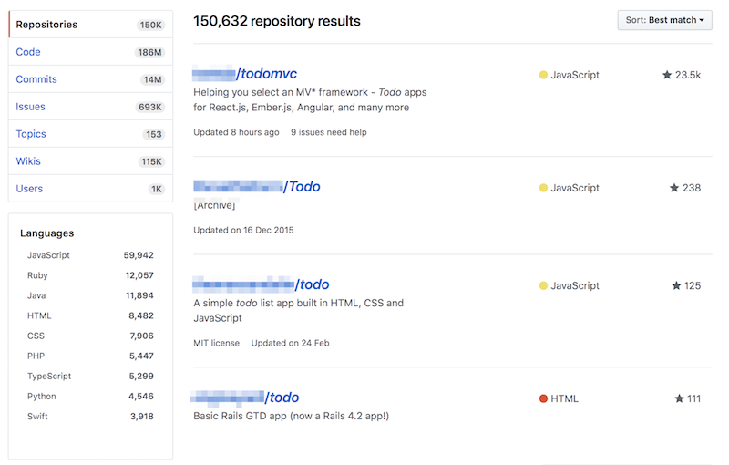
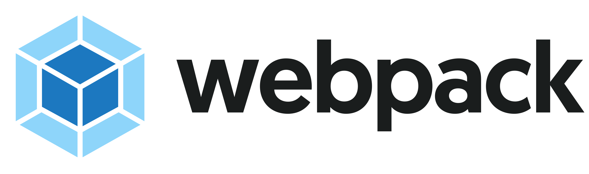

---

layout: ig

style: |

    #custom {
      background: black;
      padding-top: 0;
    }
    #custom h2 {
      color: yellow;
      margin-top: 70px;
    }

    .no-title h2 {
      display: none;
    }

    .code--size--m {
      font-size: 0.8em;
    }
    .slide .small {
      font-size: 50%;
    }
---

# How to use React, webpack and other buzzwords if there is no need  {#cover}

Varya Stepanova
{: .author }

How to use

  ,
  

and other
buzzwords
if there is no need

<!--
Cover image: http://www.adstasher.com/2013/06/k-y-jelly-love-machines-print-ads.html

I will share what strategy I used to learn new technologies in last 5 years.

-->

<!-- Picture credits: http://www.createmydreamlifestyle.com/index.php/2016/07/30/advantages-of-the-laptop-lifestyle/ -->

## Me
{: .no-title .about-me }

{: .photo }

### Now
Design Systems Specialist  at Intergalactico Nordcloud Design Studio

### Before
TMG (Amsterdam, the Netherlands); Yandex&nbsp;(Moscow,&nbsp;Russia)

### Area of expertise
Components on the web: design systems, pattern libraries, SGDD, BEM. Techs: CSS, JavaScript, etc.

<!--

My name is Varya, I have experience in development working in small to large projects across the
world. The things I have been doing are about frontend and most of the project was around something which is
currently called "design systems". In previous years, this activity had many different names like "pattern libraries",
"styleguides", "component approach", "atomic design". But whatever the naming, it included developing encapsulated
interface components. A while ago it was BEM CSS and XSL for templating, then a few JavaScript frameworks whose names
history does not remember, a little bit of Angular and currently React. Of course, since it has always been something
modular, there were various building and documenting solutions.

-->

## How to study new?
{: .how .cover }

<!--

From time to time, I faced reality. In frontend, we have a new framework every two weeks :-) As an engineer, I need to
know the new things so that I could bring my expertise into the working project. On the other hand, we usually learn by
doing. But if the working project does not offer me possibility to learn these new frameworks, libraries and building
solutions, how can I gain knowledge? This is in fact chicken-egg problem. Trying to break this circle, people usually
come up with some pet projects. What could work as such a project?

-->

## Maybe a useful app?

<!--

I know that some people easily come up with a valuable idea what could be a pet project. But some don't, and they often
do something like ToDo application. BTW, I searched "ToDO" in Github, and it gave me nearly one hundred fifty thousand
repositories. So, ToDo app is a nice idea but I really wanted something useful.

-->

## Blog

* Overengineering
* Open source
* Hosted on GitHub
* Source in Markdown
* Generated HTML

<!--

With that in mind, 5 years ago I decided that I would make my own blog. I wanted a standalone solution so that nothing
would limit my experiments. That time, I decided that I am OK with a bit of overengineering. And the end of the day, I
am doing it not only for getting the things done but also for playing around with new technologies.
I decided that everything will be open, not only the code but the texts of my posts too. I host everything on GitHub,
and anyone can explore the codebase. I even got fixes for my broken grammar! The source of the posts is in Markdown, it
is GitHub friendly and can be even edited in its web interface. For hosting, I went with GitHub pages, and
because of that the blog is actually a static HTML website. All the pages are generated into plain HTML.

-->

## March 2013: {: .jekyll }
{: .tech-stack--jekyll }

{: .bem }
{: .gnu }
borschik
bem-tools
bem-core
CSSO

<!--

The first version was built in 2013. Initially I went with Jekyll because it is embedded into GitHub. I did not need any
building step which generates HTML, I just commited the Markdown sources and GitHub itself generated HTMLs for me
according to the config. This structure has already been gone but I still sometimes use Jekyll for some other things.
For example, this presentation is hosted on GitHub and built with Jekyll.

For the blog, I was interested to bring there more frontend technologies. I began with BEM CSS, and I built the bundle
with GNUmakefile. Then I tried borschik, bem-tools, used bem-core component library and optimized the CSS with CSSO.

-->

## May 2014: DOCPAD
{: .tech-stack--docpad }

{: .grunt }
{: .gulp }
styleguide
visual regression tests

<!--

A year later I switch to Docpad for HTML generation and in parallel I experiemnted a lot with diffrent building
soltuions. It was all around BEM structure, even though it was pure CSS, the compoents were separated similar to how we
now do it in React. GNUmakefiles did not seem up to date solution and I switched first onto Grunt and later to Gulp.
Then I experimented not with technologies but with approaches. For example, I did styleguide-first approach when developing
the components for the interface. And since eveyrthing was componentized and documented, I could easily have visual
regression tests for the blocks.

-->

## January 2017: {: .metalsmith }
{: .tech-stack--metalsmith }

{: .react } {: .webpack } {: .css-modules }

* A lot of plugins
* "Server" React + "client" React

<!--

About a year ago I really wanted to include React, webpack and some styling solution into the blog tech stack. But it is a very simple site and it does not
assume a lot of interactions on client. So, I was looking for a solution which helps me to use React when generating
static HTML. Ideally, I wanted also to have some little interactions. So, some components would be mounted on client.
And, of course, I wanted these two types of components to be from the same codebase.
I looked into some other generators which I don't remember and selected Metalsmith out of all. I like that it is very
much customizable. This is one of the reasons why reaclifying is possible: there is a plugin which allows to use React
components as templates.
It also gives a lot of control over the files which it processes, and I use it a lot.

-->

## File structure

    content/
      posts/
        my-awesome-post/
          index_<mark class="important">en</mark>.md
          index_<mark class="important">ru</mark>.md

[http://varya.me/<mark class="important">en</mark>/posts/my-awesome-post/](http://varya.me) 
[http://varya.me/<mark class="important">ru</mark>/posts/my-awesome-post/](http://varya.me)

<!--

The full control over processing files helped a lot when dealing with multi-lingual structure of my blog. I write
posts in English and Russian, sometimes I translate, and sometimes posts are written in one language only. If the post
is available in both languages, I prefer to keep the sources together under the same directory. But when rendered into
the website, it looks much better if the language code works as prefix. Metalsmith gives me to manipulate all the
files in the stream, and change their location. Also, when generating HTML for a blog post, I can detect if there is
a translation to the opposite language or not. Then, I provide language switcher if possible.

-->

## Development flow

    npm run dev

* Runs development server
* Builds JavaScript and CSS bundles
* Generates HTML

    npm run build

<!--
Frontend-wise, the building happens so that React components which work as templates are gathered together with
webpack. This makes possible to process imported CSS and images. JavaScript works to output the static HTML. Other results
of the build are CSS to apply to the page and another piece of JavaScript, which is needed for dynamic components. In
theory, since it is webpack, I can use all kinds of loaders and plugins. For example, it must be possible make it
very much optimized.
-->

## The Frontend
{: .frontend }

* React components for SSR
* React components for browser
* CSS modules for both
* {: .styled-components .next }

<!--

So far, in current stack I use React components for server-side rendering and for browsers. In both, there are CSS
modules for styling. And I have started it just a couple days ago - there is styled-components for one component yet.
This is a funny story, I wanted to use styled-components long time and I am actually already using them at work. But in
the blog I has difficulties and I figured out that it is probably not possible due to some reasons. At the same time
preparing this talk forced me to fix some inaccurases in webpack configuration. And than I was like "what if I try
styled-components again?". And it worked! The only reason it sis not work previously was that I actually over-wrote the
CSS bundle because webpack configuration was wrong. So, maybe the idea for the next talk is "how to master the
technologies - just annonce a talk about them, then you have no choice but deliver".

-->

## Pros & cons
{: .pros-cons }

### Happy

* Overengineering :-) Fancy new technologies
* Fast building process
* Not large codebase, open for experiments
* Ready for framework-of-the-week

### Sad

* Overengineering :-( Writing a blog and not writing for the blog
* Solution specific limits

<!--

It had been over a year since I switched the blog into Melatsmith with React, css-modules and Webpack. I am mostly
happy with this solution. Yes, it sometimes feels as overengineering because the website is so simple. But this was what
I wanted for playing around. Metalsmith is much faster than Jekyll or Docpad, so that I can stand the building process.
In general, a blog as a pet project is a very nice idea. It is yet simple, even with all the introduced technologies the
codebase it not large. It can be easily handled when I am making new experiments with some framework-of-the-week.
However, there are of course drawbacks. This overengineering results into writing the blog instead of writing for the
blog. And there are some soltuion specific limits. This styled-components story did not happen to me in my work project,
it was super easy to start using there but not in the blog.
Anyway, this is not the end. I think that I will refactor it again and again with other static generators. If you have
ideas, please share it with me.

-->

## Thank you
{: .thanks }

Varya Stepanova, Intergalactico - Nordcloud Design Studio 
[@varya_en](https://twitter.com/varya_en){: .twitter }; on the web: [varya.me](http://varya.me){: .web }

### Slides

### [varya.me/react-finland-2018](http://varya.me/react-finland-2018/)

<!--
Thank you very much! You can always reach me out in twitter, or in the afterparty.
-->

