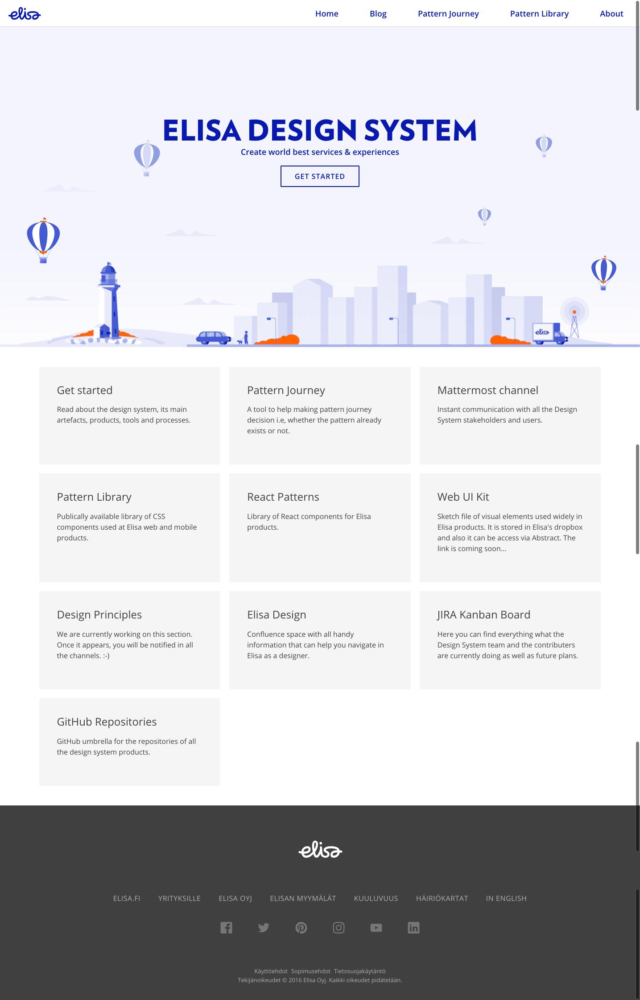
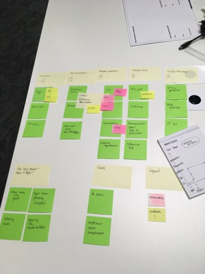

---

layout: ig

style: |

    #custom {
      background: black;
      padding-top: 0;
    }
    #custom h2 {
      color: yellow;
      margin-top: 70px;
    }

    .no-title h2 {
      display: none;
    }

    .shower.full .slide::before {
      z-index: 1000;
    }

    .shower.full .slide.no-pulse::before {
      display: none;
    }

    .slide h3 {
      text-transform: none;
    }

    .code--size--m {
      font-size: 0.8em;
    }
    .slide .small {
      font-size: 50%;
    }
    .slide--shout h3 {
      color: currentColor;
      font-size: 4em;
      font-weight: bold;
      margin-top: 0.5em;
    }

    .x2 {
      font-size: 1.5em;
    }
---

# Building design systems that leverage your designers, developers, and products {#cover}

Varya Stepanova, Design Systems Specialist 
[@varya_en](https://twitter.com/varya_en), [varya.me](http://varya.me/)
{: .author }

<!--

Hello. My name is Varya, I am a design systems specialist.

-->

## Me
{: .no-title .about-me }

{: .photo }

### Now
Design Systems Specialist  at Intergalactico — Nordcloud Design Studio in Helsinki.

### Before
TMG (Amsterdam, the Netherlands); Yandex&nbsp;(Moscow,&nbsp;Russia)

### Area of expertise
Components on the web: design systems, pattern libraries, SGDD, BEM. Techs: CSS, JavaScript, etc.

<!--

My name is Varya, I have experience in development working in small to large projects across the
world. The things I have been doing are about frontend and most of the project was around something which is
currently called "design systems". In previous years, this activity had many different names like "pattern libraries",
"styleguides", "component approach", "atomic design".

Today I would like to focus on not technical aspects of design systems. Or precisely how to build and organize the
design system which takes into account your company situation, suits specific products and is useful for your teams.

-->

## What are design systems?
{: .slide--shout .slide--blue .no-title }

### What are design systems?

## Various design systems
{: .no-title }

{: .cover }

<!--

If you compare design systems of different comanies, it will be very visible how differently they approach the subject.

No wonder since as a concept design systems contain various subtopics. It's not possible and also not needed to have
this all. When buildign their design systems, the companies focus on what is more relevant for them.

Some implement libraries of components, some focus on visual guidelines, some focus on
processes. If they work in all these aspects, they still do it differently.

When applying the gain knowledge to your own design system (if you start or manage it), it's very difficult to find out
what path to follow. Just copying approaches of some public design system might not fit your organization and products.

-->

## Elisa
{: .no-title .elisa }

<object
    class="ea-logo--large"
    type="image/svg+xml"
    title="Elisa"
    data="http://static.elisa.fi/components/pattern-library/6.3.0/release/images/elisa-logo.svg"></object>

### [corporate.elisa.fi](https://corporate.elisa.com/?_ga=2.86825873.809942848.1539693337-1214540075.1534242252){: .color--pink }

## Elisa 2018 journey
{: .no-title .elisa-2018 }

### Design system at
<object
    class="ea-logo"
    type="image/svg+xml"
    title="Elisa"
    data="http://static.elisa.fi/components/pattern-library/6.3.0/release/images/elisa-logo.svg#{$modifiers}"></object>
### in 2018

* Great design community
* World-class front-end teams
* UI kit
* Library of CSS components
* Libraries of React components
* Shared tools and practices

<!-- TODO: represent it as  nice images -->

<!--

From the beginning of this year, I have been working on a design system for Elisa. Not from scratch. It aleady existed
and had all these artefacts.
It's a huge product which includes several UI libraries. Nor only CSS implementtaion but also more complex React logic.
There is a lot of patterns in each of them and there is a large UI kit in Sketch. Apart from technical perspecitive,
design system at Elisa means communication practises, visual guidelines, shared processes and tools.
By that time, it was already successful. We even proved this fact with feedback from our project teams and calculations
of cost savings.
But these artefacts of design system grew and so grew the workload. At the same time we were looking for how these all
can work together more smoothly and bring more value.
How do we aproach it?

-->

## What?
{: .no-title .what .no-pulse }

<h3 class="wtitle">
  How?
  What?
</h3>

<!--

The main question here was "what should we do?". According to my experience, it is often skipped. People start from "how
we do this?" meaning that the what is obvious. I myself did it dozens of times. And this "how" approach still leads to
good result. If you work hard, you will get something good. But can we do even better?

What if we consider a desgin system as a service within the organization? It is internal service but it still works
similarly to the services we provide for the company customers.
Then, similarly to designing a regular service, we do not skip this "what" part but invest a good research and ideation
into it.

When deciding what to do where is nothing obvious, it is territory of unknown.
IN the context of design systems, remembering this is very crusial. We all are designers or technical specialists. We
have a lot of assumptions about how the things should be done and what we have to do. We feel very confident about that
because we are professionals in the field.
But in fact, similarly to developing any other service, there is nothing obvious. It is very likely that the community
has differnt needs.
It is always good to focus on a bigger picture - "what are we here for?". In a bigger organisation, we are all together
to provide software products, to offer them for the company customers and so generate business value.

So, let's see WHAT we can do for this purpose.

-->

## Design thinking

### & User Centered Methods
{: .subtitle }

{: .cover }

<!--

Image source: http://www.reply.com/en/design-thinking

Keeping in mind that there is nothong obvious, we decided to apply the design thinking approach and service design
methods.

-->

## Research
{: .slide--shout .slide--yellow .no-title }

### Research

## Getting data

* Industry research
  - learning from you
* Automatic collection of quantitative data
* User research
  - questionnaires
  - *interviews* with teams
  - documenting feedback

<!--

So we followed the classic design process which includes interviews in the focus group. For the design system case, our
focus group are the product teams which use UI kit and the libraries. We met all the teams and had conversation with
designers, developers and PO's. This way, we could get information from differnt perspectives. And it was very visible
how developers comment on technical aspects, designers give their feedback and share ideas on the design part and PO's
give us business perspetive.
We have typescripts of all these interviews. This is an important point because during the next phases we came back to
this infromation again and again. So it was very good to have it written.

Later, we also included other sourses of information such as documented feedback and information from public sources. We
used to work with feedback previously but the older ways was direct respond trying to serve the people in the best way.
Now we document everything we get and so raise our knowledge bank.

Besides, we are constrantly studying the situation around us, what other compaies do and what they share. We dedicate
time for such studies and often have a preliminary goal, what are the answers we are looking at.

-->

## Process the info
{: .process }

* What we are doing now
* What people expect us to do
* Our dream activities 
  *How would we respond to the requests if we <b>could</b>.*
* What we can offer now

{: .pl }
{: .r }
{: .r2 }
{: .con }
{: .com }

<!--

After getting the raw data, we started to process it. Design thinking approach is cyclic, so that you go through the
stages again and again. So, neigther getting infromation nor processing it nor other steps are never "done". But I can
tell how it was at some iterations of it.

We were focusing yet on a low level and we planned how we could serve the direct requests
of the people.
After initial team interviews, we compared what we were doing with what people extected us to do. They wanted much more
and it was our dream to do this all. However, resources are always limited so that we developed more realistic plan.

Of course, it is possible to add the
resourses and extend the design system team for keeping this path. But I am grateful that we have tight resourses
because it helpped us to look at the bigger picture and focus on finding out how we can change this situation.

During this processing of information it became visible that the design system team and the project teams have different
perception of the situation. They requested a lot. Why? It was not the situation that they did not like what we have
done, the feedback about existing things was positive. But they still viewed the things which design system offers and
the role of the design system team a bit differently. We wanted to learn how much differently and so we run the
workshops.

-->

## Participatory methods
{: .slide--shout .slide--violet .no-title }

### Participatory methods

## Workshops
{: .workshops .no-title }

| | | | | |
| | | | | |
| | | | | |
{: .workshops--table .next }

<!--

Picture source: https://galleryhip.com/two-different-groups-of-people.html

We had two workshops with the help of Kauri Salonen. You could heard his talk at recent Design Systems Conference in
Helsinki or at some other events. He has a loud name and he was a huge help.

The approach he used was from DevOps. And actually it's very similar. When building design systems we are doing design
operations. So why not to use gained knowledge from DevOps area? This is what we applied in the workshops.

We had two session with two different groups. First group was the design system team. In the second group there were
representatives from the product teams. The two groups had independent workshops so that at the end we had different
results and an opportunity to compare them.

Each workshop was a discussion about ideal but realistic process to happen when recognizing a new pattern, designing and developing
it and then using at the products. Ideally it would be nice to have such a discussion about different scenarious like
fixinf a bug or changing a pattern used across the whole company, or changing brand. But it's not possible to discuss everything
in couple of hours, so we narrowed it down to just one question: what happens with a new pattern.

In the discussion, we outlined the stages of creating a new pattern from identifying the buisness need to delivering the
pattern to the company products. Then we had an image of the whole process from three different perspectives: what is
happening, who is making it happened and who they do it.

It turned out that we got very different results. This underlined the problem that there is informational gap around the
topic of desigin system.

Here I have to say that by metrics the situation is very good. There is a lot of products reusing the components. But we
found a place which we could inprove even with given resourses.

This made us focus on information availability for the design system.

-->

## Outcomes
{: .slide--shout .slide--blue .no-title }

### Outcomes

## Design system is a process
{: .new-process }

<!--

We decided that for us a desgin system is a process that benefits software products. We still have UI kit, the library
of components but they happen automatically whereas we are focused on keeping the process smooth.

-->

## Our goals

- Ensuring proper usage
- <mark>Increasing contributions</mark>
{: .x2 }

## Everyone to be involved
{: .involved }

<!--

Fishing rod not fishing

We want to have everyone involved. However, there is a paradox. Not everyone in the organization is interested in all
the aspects of design systems, and not everyone has knowledge how to make it. This is more than normal, we all have
different professional focuses. At the same time, the desgin system team want exactly these people to be involved
because they are the most close to the products and to the business cases.

So, stepping into the design system should be very smooth, the learning curve should not be steep. And it should be
possible to participate just a bit. Or to contribute very little, as much as a person can do at the moment.

-->

## Information availability
{: .slide--shout .slide--yellow .no-title }

### Information availability

<!--

That said, we made a decision to really focus on information availability for our design system.
Of course, our system was already well documented and we did have processes of communication with our users and
contributors. But anyways, previously, this was our second taks while the main focus was the production itself.
Today, we are approaching differently and make information our main focus. We specificaly ideate on what we have to
deliver as information and which way we present it.

-->

## Domain

- <b>What we have done?</b> 
  Release notes, human-friendly explanations
- <b>What we are doing?</b> 
  Github reports, JIRA status, sharing on meetings
- <b>What we are going to do?</b> 
  Announcements, asking for advice
- <b><mark>How we are doing all of that?</mark></b>{: .next }

<!--

Speaking about what exactly we communicate to our colleagues, I categorized it like the following.

First of all, we speak about what we have done, present the design systems and a product for the following usage. We
indeed used to do this previously and so we continue. We have both automated and manual processes. For example, the
release notes are generated from the pull requests we merged for the new version. But this is often too generic and
booring for people. So, we like to highlight the key parts with separate human-readable stories and explanations on the
new release features.

As we want the contributors to be the most included into the process, we also share about what we are doing now. For
that, we again gather information from GitHub. This time, also about the pull requests, which are just merged or yet
open. We say who has made them, what is the content and what are the status of the reviews.
We make similar extracts from JIRA since besides the code changes, JIRA reflects all our activities, including workshops
made, meetings run, concepts developed.
And finally we communicate to the people in person, either at the regular meetings or privately.

We would like to get the feedback of our users and suggestions from our contributors as early as possible. This is why
we share even before the work has started. If the is an idea of new pattern or feature in our design system, we discuss
it before implementing.

And the most important part, now we do tell a lot about how we are doing things. We want everyone to be involved and we
see it that anyone can do our job if properly guided. There should not be any "firm secret" in our actuvity. So, we
share about technical approaches we are using, the processes we are going through, about the architectural details of
our solutions. Mostly, we are trying to express it in sharp and precise tutorials and explanations. Something which is
obvious for us doing this job day to day may not be so clear for the others whose focus is different. We are trying to
remember it.

-->

## Reach people

- At regular meetings
- With product teams by request
- Channel in instant messenger
- Intra website 
  *Documentation, tutorials, blog, experiments.*

<!--

We use different channels for communication. At Elisa, there are are regular meetings with free agenda like Design
bi-weekly or Frontend bi-weekly. Also, the company organizes workshops and internal meetups. We at the design system
team make sure that our presence at such meetings is contant and also that we often speak there.

We also communicate with product teams by their request. A team can ask for workshop, consultation, pair programming
session or code examination.

We have a dedicated channel in instant messenger, for the Elisa's case it's mattermost but in general it can also be
Slack, Flowdock or any other. The main point is that people can always reach the design system team there. We are even
trying to do out internal communication via this channel but not to much. We want to show the people current status but
we do not want to spam them.

Besides, we are making steps to involve all the others into open conversation. If there is something for discussion, we
mention relevant people right away so that they could share their opition. So far, we already managed to make the
channel a place where designers and developers communicate. And as I see, bridging the designer-developer gap is one the
missions of design systems in general.

Then, going further, we started to think: okey, design systems are so valuable because it is single sorce of truth for
the brand, for UI elements, sometimes even for implementation. But what if our design system itself needs something
which is a single source of truth for it? That said, we invested into developing an internal website.

-->

## Single point of truth
{: .website .no-title }

{: .pic }

<!--

A bit more about it. The website is internal, so there is only screenshot here.

Previously, we did have some websites which documented the design system products. CSS library is presented at a style
guide website which is even available pubically. React library has an internally hosted Storybook website. But that's
for products. Design systems are more than just libraries. They are also set of practises, processes we follow, all the
  tools we share. events we run. All these things have to be accessibsle.

Even if eveyrthing is open, in a sense that process is visible in issue tracker, code is open in the repository and so
one, people still have to know where to search this things for. It is much more convinient if you know one URL, and then
it links you to eveyrthing.

We made the website internal because it let us freedom not to think about NDA and be the most open. The structure you
are seeing now is very much initial. At the moment, we are right in the process of tailoring what and how to show there.
But there is already information for the newcomers, direct links to the products of design system, links to GitHub and
JIRA, various tutorials and the blog. In the blog, we write about what we have done and what we are going to do. And we
also encourage our users and contributors to be the authors.

-->

## be creative
{: .slide--shout .slide--violet .no-title }

### be creative

<!--

When we are working on this website, we are trying to be creative. It is not just for writing long texts for
documentation. We have them already and no one reads them anyway :-) It is also very important how you repredent the
information. It has to be interesting for people and still useful. We are trying to experiment in this area.

-->

## What do I do when.. ?
{: .what-do-i-do }

{: .pic }

Source: [Brad Frost, "Maintaining Design Systems", Chapter 5](http://atomicdesign.bradfrost.com/chapter-5/)
{: .note }

<!--

Remember this picture? Brad Frost visualised what happens to a pattern, what is its journey. You can have a closer look
if you check out his "Maintaining Design Systems".
As a design system team, we guided our patterns in these journeys all the time. It was not documented because after you
have spend couple of years with it, it becomes common sense for you. But is it common sense for the users of design
system? Especially new comers. And is it so obvious for the potential contributors?
Here I would like again to reffer to the workshop we run separetely for the design system team and for the team of
users. It showed very clearly that two groups see the process of creating a pattern very differently. Having understood
that, and wanting also to catch the attention for the people, we extended this idea of decision tree into interactive
component.

-->

## Interactive decision tree

<iframe width="738" height="415" src="https://www.youtube.com/embed/kKnTN3EswnU" frameborder="0" allow="autoplay; encrypted-media" allowfullscreen></iframe>

<!--

Our design system website is built the way that we can put any React component there. So we do not limit ourselves :-)
We developed the concept of "pattern journey" to visualise what people should do when they found themselves in a need of
a new pattern. Do they take it from the library? Do they implement it themselves and put into the library? Do they just
implement it and keep at their project?

This decision tree guides our colleagues. They have simple question to be answeed "yes" and "no". Each node here can
open a popup with explanations how to find and answer to this question. In this version you see just a plain text but in
reality it also has links to here and there. Like, "check in this repository", or "find in JIRA with the help of this
filter".

Also remeber, this all was about design thinking which suggests us to prototype and try. So, we made such a tree for
only one of our products - the CSS library. We are planning to learn if it helps and then extend it to the other
products or change. it.

-->

## Not just long texts

* <b>Screencasts</b> 
  * How to add a new icon?
  * How to release?
  * How how how?
* <b>Dynamic content</b> 
  Extracts from GitHub and JIRA
* <b>Interactive interface solutions</b> 
  React components embedded into the website.

<!--

Similarly, we are trying differnt types of content for representing many other information. When doing the routine, we
make screencasts. It is often much faster than writing a proper blog post or documentation. And this way we would like
to make eveyone be able to add a new icon or even to release the library.

As I said, we can make React component at our website, and it is internal so no security issues. So we can use GitHub or
JIRA APIs to get information from there and represent it in nicer ways right on the website pages. This very much
increases the visibility of the whole thing.

At some point we even made and SVG cartoon run as another React component. This really atracts our colleagues.

-->

## Tailor the processes

The process <mark>has to cover all</mark> we do. 
But it <mark>has&nbsp;to be simple</mark> for others to grasp. 
We need to make it <mark>visible</mark>.
{: .x2 }

<!--

Besides the website which in fact documents the reality, we are also trying to change this reality. Based of the
knowledge we gained from our research, we are also trying to tailor our processes.

That information gap between the design system team and the users was not only because we did not communicate our point
of view. But also because we were doing something not in the best way. Some of their ideas were better and we got them
into use. However, changing a bit and again aligning with our major goal to facilitate the process and get everyone
involved.

So we wanted to change our process to that it covers all our activities, but at the same time it is quite simple for all
the others to understand and even find themselves in that process. And we wanted to make it somehow visible and
available. Previously, we tried Trello and issues on GitHub, but it did not play well.

-->

## Inventing the flow
{: .inventing-flow }

{: .pic }

* <b>Flow for all the activities</b> 
  visual language updates, patterns production, automation, documentation, championing...
* <b>Easy to focus on something specific</b>
* <b>Keep the information for further usage</b>

<!--

So, we went through a real ideation session. Yeah, now we like workshops and sticket notes even for internal things.
Because it really works, we made so much with it.

We categorized all the types of activities we are doing like working with visual language, component production, making
documentation, helping the teams. All to see some common ground and bigger picture of bigger process.

We realized that what we are doing does not fit into regular workflow when a task is first in ToDo, then in Progress,
then Done. Yes, it is the flow to smaller chunks but all together our activities are living different cycle. So, we
invented 2-dimension matrix to see it from both perspectives.

We were looking
for representation of it which would show the whole picture at once. And at the same time would be very useful if
  someone wants to focus only on a specific area like one of the epics or area of some person and so on.

And we also took into account that we would like to use our task tracker as a data base. We are providing attributes
which later help us to focus on a specific pattern or specific project and so on. This databased already paid back when
we were calculating upcoming progress and team expenses from the financial perspective. The business people were very
pleased with the approach.

-->

## be unique
{: .slide--shout .slide--pink .be-unique .no-title }

### be unique

<!--

So, I showed you just some examples of what can be done. The story never ends and it most likely it will be different
for you when you apply the approach to your design system which is made for your company, for your products and for the
  people you are working to. Make your own unique design system which would be very best for you.

-->

## Thank you
{: .thanks }

Varya Stepanova, Intergalactico - Nordcloud Design Studio 
[@varya_en](https://twitter.com/varya_en){: .twitter }; on the web: [varya.me](http://varya.me){: .web }

### Slides

### [varya.me/design-systems-thinking](http://varya.me/design-systems-thinking/)

<!--
Thank you very much! You can always reach me out in twitter, or in the afterparty.
-->

