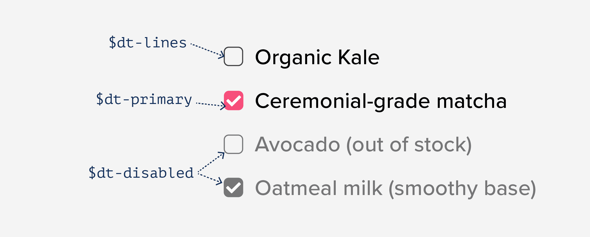
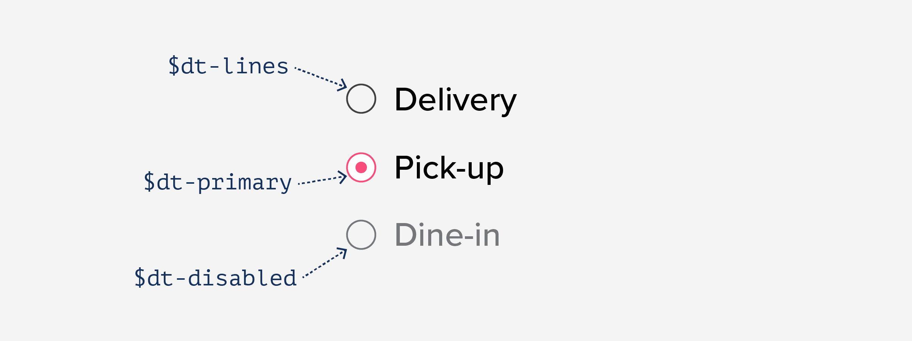
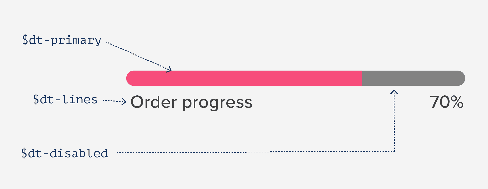
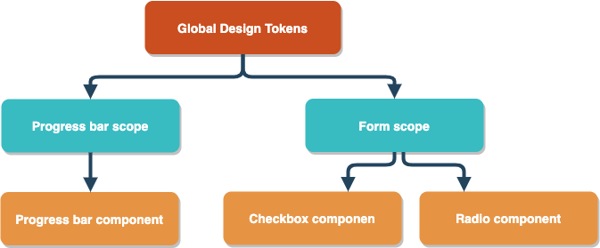
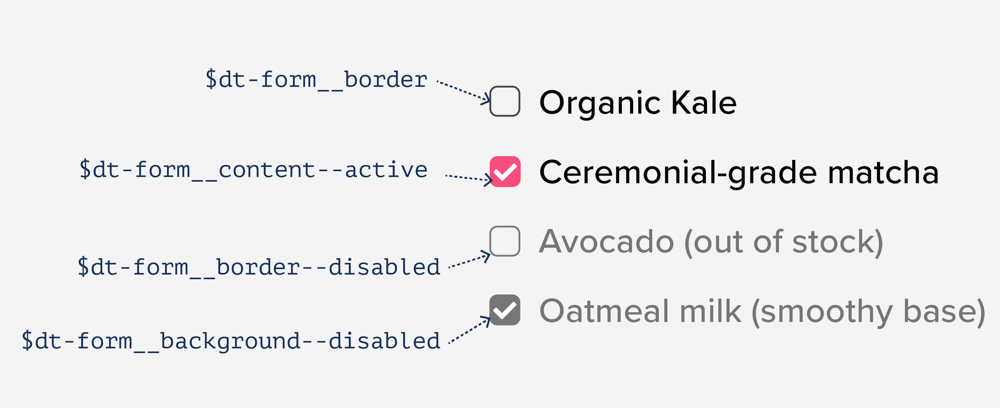
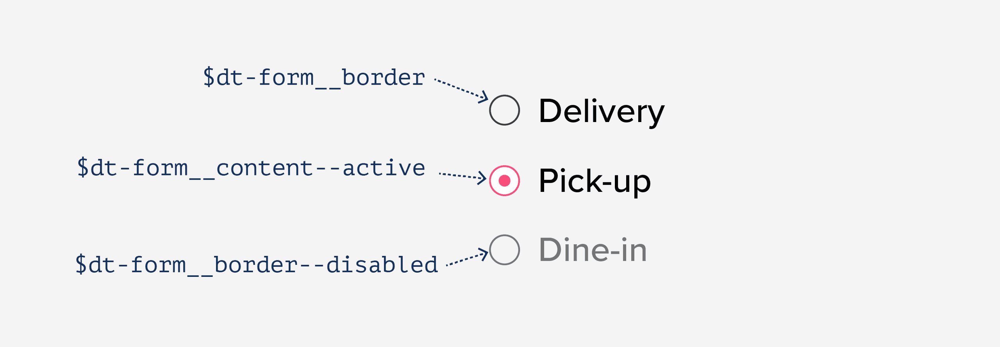
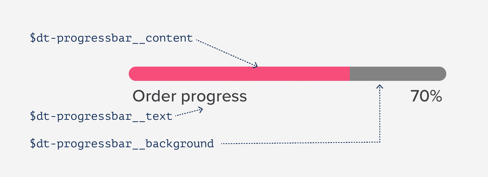

---

layout: ribbon

style: |

    #Cover h2 {
        margin:30px 0 0;
        color:#FFF;
        text-align:center;
        font-size:70px;
        }
    #Cover p {
        margin:10px 0 0;
        text-align:center;
        font-size:20px;
        }
    #Picture h2 {
        color:#FFF;
        }
    #SeeMore h2 {
        font-size:100px
        }
    #SeeMore img {
        width:0.72em;
        height:0.72em;
        }


    .slide--center {
      text-align: center;
    }
    .slide--center .slide__content {
      text-align: justify;
    }
    .no-title h2 {
      display: none;
    }

    .slide .relevant-link {
      font-size: 0.5em;
      position: absolute;
      bottom: 25px;
      margin-bottom: 0.25em;
    }

    .slide .quadruple {
      column-count: 4;
    }
---

# <span class="guide">Design Tokens</span> <span class="building">and</span> <span class="ds-infrastructure">Component Driven<br/>Development</span> {#Cover}


<b>Varya Stepanova</b>, Design Systems Architect / [varya.me](http://varya.me)
{: .author }
@ [Brudge the Gap, design systems breakfast](https://www.eventbrite.com/e/bridge-the-gap-casual-breakfast-on-design-systems-tickets-136072952865), January 28<sup>th</sup>, 2021.
{: .event }

<style>

#Cover {
  padding-left: 60px;
  padding-right: 60px;
}

#Cover,
#Cover h2,
#Cover p
 {
  color: black;
}

#Cover h2 {
  font-size: 55px;
  margin-top: 100px;
  line-height: 1em;
  text-transform: capitalize;
}

#Cover h2 .guide {
  display: block;
  color: #38bcc2;
}

#Cover h2 .building {
  font-size: 40px;
  font-family: "Graphik Light";
  display: block;
  text-transform: lowercase;
  margin-top: 0.25em;
}

#Cover h2 .ds-infrastructure {
  color: #ca4e1f;
}

#Cover .author {
   text-align: right;
   margin-top: 145px;
}

#Cover .event {
  font-size: 0.5em;
  text-align: right;
  margin-top: 0;
}

</style>

<!--

Hello. My name is Varya, and my talk is about -- surprise! -- design systems. However, I will keep it very practical. I
would like to show how we could use our developers' knowledge and ability to code and apply it to the domain of design
systems. Using certain technologies, we can build not only the interface components but also infrastucture and tools for
our design system to run.

-->

## Me
{: .no-title .about-me }

{: .photo }

### Varya Stepanova
<b>Design Systems Architect</b><br/>
<small>independent consultant</small>

#### Contacts
* [@varya_en](https://twitter.com/varya_en){: .twitter }
* [varya.me](http://varya.me){: .web }
* [mail@varya.me](mailto:mail@varya.me)
{: .contacts }

#### Focus
Design systems: production and governance,<br/>pattern libraries, style guides, UI/UX, front end.

<style>
.about-me p {
  font-size: 80%;
}
.about-me .photo {
  float: left;
  width: 300px;
  margin-top: 1em;
  margin-bottom: 6em;
  margin-right: 1em;
  border-radius: 50%;
}

.about-me h4 {
  color: #ca4e1f;
  font: 1em/1 'FF Meta Serif',sans-serif;
  margin-bottom: .5em;
}
.about-me b {
  font-size: 1.25em;
}

.about-me .contacts {
  line-height: 1;
  font-size: 0.8em;
}
.about-me .contacts li:before {
  content: '';
}

.about-me .twitter
{
  text-decoration: none;
  color: currentColor;
  background: none;
  border-bottom: 0;
}
.about-me .twitter::before
{
  content: "";
  display: inline-block;
  width: 1.5em;
  height: 1.5em;
  background-image:url('pictures/twitter-logo.png');
  background-size: cover;
  margin-right: 0.5em;
  margin-bottom: -0.5em;
}
</style>

<!--

First, a few words about myself. Design Systems has been my major focus even before the buzzword appeared. I have nearly
15 years of experience in frontend development, mostly doing the things related to the components on the web. Back then
it was component solutions in CSS and JavaScript, later styleguides and pattern libraries, and nowadays
finally design systems. I worked on technical aspects of design systems in several projects and also did a lot of
team and project management in this field.
At the moment, I am self-employed expert in design systems.

-->


## Design Tokens
{: .design-tokens .slide--shout .slide--highlighted }

{: .svg .image }

<style>
.design-tokens .image {
  width: 250px;
}
</style>

<!--


-->


## Design Tokens
{: .react-world .slide--center }

- reduce duplicated work
- keep shared context within one team
- help cross-company collaboration
- accessible on-brand web and mobile apps
- ensure smooth UX
- empower us to create better products


<!--

-->


## Case study
{: .case-study .slide--shout .slide--primary }

{: .svg .image }

<style>
.case-study .image {
  width: 250px;
}
</style>

<!--

-->


## The tokens
{: .the-tokens }


```
$dt-primary: #f74d7b;
$dt-disabled:  #767677;
$dt-inverse: #FFFFFF;
$dt-lines: #404041;
```
{: .code }

<div class="color-boxes">
  <div class="item primary"></div>
  <div class="item disabled"></div>
  <div class="item inverse"></div>
  <div class="item lines"></div>
</div>

<!--

-->

<style>
.the-tokens .slide__content {
  position: relative;
}
.the-tokens .color-boxes {
  content: '';
  display: block;
  position: absolute;
  top: 0;
  left: 0;
  margin-left: -1.5em;
  width: 1em;
  height: 100%;
}

.the-tokens .color-boxes .item {
  width: 1em;
  height: 1em;
  margin: 0.5em 0 1em 0;
  border: #666 1px solid;
}
.the-tokens .color-boxes .primary {
  background-color: #f74d7b;
}
.the-tokens .color-boxes .disabled {
  background-color: #767677;
}
.the-tokens .color-boxes .inverse {
  background-color: #FFFFFF;
}
.the-tokens .color-boxes .lines {
  background-color: #404041;
}
</style>


## The tokens and the checkbox
{: .checkbox }

{: .image }

### … very well!

<style>
.checkbox .image {
  width: 100%;
}
</style>

<!--


-->


## , and the radio button
{: .radio-button }

{: .image }

### … looks good!

<style>
.radio-button .image {
  width: 100%;
}
</style>

<!--


-->


## , and the progress bar
{: .progress-bar }

{: .image }

### … meh…

<style>
.progress-bar .image {
  width: 100%;
}
</style>

<!--


-->

## The problem
{: .problem .slide--shout .slide--primary-light }

{: .svg .image }

<style>

.problem .image {
  width: 250px;
}
</style>

<!--


-->

## Contexts

- global variables
- encapsulated components


##  Solution
{: .solution .slide--shout .slide--highlighted }

{: .svg .image }

<style>
.solution .image {
  width: 250px;
}
</style>

<!--


-->

## Middle layer
{: .middle-layer }

{: .image }


<style>
.middle-layer .slide__content {
  text-align: center;
}

.middle-layer .image {
  margin-top: 1.5em;
}
</style>


## Tokens and their semantics
{: .semantic-tokens }

```
$dt-color__neutral--900: #000000;
$dt-color__neutral--700: #404041;
$ds-color__neutral--400: #767677;
$dt-color__neutral--100: #FFFFFF;
$dt-color__neutral: $dt-color__neutral--900;

$dt-color__primary: #f74d7b;

$ds-color__transparent: transparent;
```
{: .code }

<div class="color-boxes">
  <div class="item neutral-900"></div>
  <div class="item neutral-700"></div>
  <div class="item neutral-400"></div>
  <div class="item neutral-100"></div>
  <div class="item neutral"></div>
  <div class="item blank"></div>
  <div class="item primary"></div>
  <div class="item blank"></div>
  <div class="item transparent"></div>
</div>

<!--

-->

<style>
.semantic-tokens .code {
  font-size: 0.9em;
}
.semantic-tokens .slide__content {
  position: relative;
}
.semantic-tokens .color-boxes {
  font-size: 0.9em;
  display: block;
  position: absolute;
  top: 0;
  left: 0;
  margin-left: -1.5em;
  width: 1em;
  height: 100%;
}

.semantic-tokens .color-boxes .item {
  width: 1em;
  height: 1em;
  margin: 0.5em 0 1em 0;
  border: #666 1px solid;
}
.semantic-tokens .color-boxes .blank {
  visibility: hidden;
}
.semantic-tokens .color-boxes .neutral-900 {
  background-color: #000000;
}
.semantic-tokens .color-boxes .neutral-700 {
  background-color: #404041;
}
.semantic-tokens .color-boxes .neutral-400 {
  background-color: #767677;
}
.semantic-tokens .color-boxes .neutral--100 {
  background-color: #FFFFFF;
}
.semantic-tokens .color-boxes .neutral {
  background-color: #000000;
}
.semantic-tokens .color-boxes .primary {
  background-color: #f74d7b;
}
.semantic-tokens .color-boxes .transparent {
  background-image:
      linear-gradient(45deg, #ccc 25%, transparent 25%), 
      linear-gradient(135deg, #ccc 25%, transparent 25%),
      linear-gradient(45deg, transparent 75%, #ccc 75%),
      linear-gradient(135deg, transparent 75%, #ccc 75%);
    background-size: 1em 1em; /* Must be a square */
    background-position:0 0, 0.5em 0, 0.5em -0.5em, 0px 0.5em; /* Must be half of one side of the square */
}
</style>


## Variables for form elements

```
$dt-form__border: $dt-color__neutral--700;
$dt-form__border--disabled: $ds-color__neutral--400;

$dt-form__content--active: $dt-color__neutral--100;

$dt-form__background: $dt-color__transparent;
$dt-form__background--disabled: $ds-color__neutral--400;
```
{: .code }


## Checkbox
{: .checkbox2 }

{: .image }

### … super!

<style>
.checkbox2 .image {
  width: 100%;
}
</style>

<!--


-->


## Radio
{: .radio2 }

{: .image }

### … fantastic!

<style>
.radio2 .image {
  width: 100%;
}
</style>

<!--


-->


## Progress-bar scoped
{: .progress-bar-scope }

```
$dt-progressbar__background: $ds-color__neutral--400;
$dt-progressbar__content: $dt-color__primary;
$dt-progressbar__text: $ds-color__neutral—700;
```
{: .code }

## Progress bar
{: .progress-bar2 }

{: .image }

### … awesome!

<style>
.progress-bar2 .image {
  width: 100%;
}
</style>

<!--


-->


## Naming
{: .naming .slide--shout .slide--primary-light }

{: .svg .image }

<style>

.naming .image {
  width: 250px;
}
</style>

<!--


-->

## BEM-like names

The good old mental model :-)

```
.block__element--modifier

$dt-group__element--variant
```
{: .code }


## In general
{: .in-general .slide--shout .slide--primary }

{: .svg .image }

<style>
.in-general .image {
  width: 250px;
}
</style>

<!--

-->

## Tokens in JavaSript
{: .tokens-in-js }

```
export const colors = {
'neutral--900': '#000000',
'neutral--700': '#40404A',
'neutral--400': '#D2D2D6',
'neutral--100': '#FFFFFF',
'neutral': '#000000',

'primary': '#006AED',

'transparent': 'transparent',
}
```
{: .code }

<style>
.tokens-in-js .code {
  font-size: 75%;
}
</style>


## styled-components
{: .styled-components }

```
import { colors } from './tokens.js';

const form = {
  'background': colors['transparent'],
  'background--active': colors['primary'],
  'background--disabled': colors['neutral--400'],
  // …
};

const StyledCheckbox = styled.div`
  background: ${props => props.disabled ? form['background--disabled'] : form['background']};
  // …
```
{: .code }

<style>
.styled-components .code {
  font-size: 75%;
}
</style>

## Thank you
{: .thanks }

{: .photo }

### Design Tokens and Component&nbsp;Driven&nbsp;Development

### [Slides: varya.me/ds-breakfast-01-2021](http://varya.me/ds-breakfast-01-2021/)
{: .slides }

#### by Varya Stepanova
* [@varya_en](https://twitter.com/varya_en){: .twitter }
* [varya.me](http://varya.me){: .web }
* [mail@varya.me](mailto:mail@varya.me)
{: .contacts }


#### Credits
{: .credits__title }
Illustrations by [Jorge Lainfiesta](https://twitter.com/jorgelainfiesta).<br/>
Icons made by [Freepik](https://www.freepik.com/){: title="Freepik" } and
[Eucalyp](https://creativemarket.com/eucalyp){: title="Eucalyp" } from [www.flaticon.com](https://www.flaticon.com/){: title="Flaticon" }.
They are licensed by
[CC 3.0 BY](http://creativecommons.org/licenses/by/3.0/){: title="Creative Commons BY 3.0"}.
{: .credits }

<style>

.thanks .credits,
.thanks .credits__title {
  font-size: 0.5em;
}

.thanks h3 {
  font-size: 28px;
  margin-bottom: 0.5em;
  margin-top: 1em;
  line-height: 1.25em;
  font-family: "Graphik Light";
}

.thanks .slides,
.thanks .slides a {
  color: #ca4e1f;
  font-family: "Graphik Light";
  text-transform: none;
}

.thanks .photo {
  float: left;
  width: 150px;
  margin-top: 1em;
  margin-bottom: 8em;
  margin-right: 1em;
  border-radius: 50%;
}

.thanks .contacts {
  line-height: 1;
  font-size: 0.8em;
}
.thanks .contacts li:before {
  content: '';
}

.thanks .twitter
{
  text-decoration: none;
  color: currentColor;
  background: none;
  border-bottom: 0;
}

.thanks .twitter::before
{
  content: "";
  display: inline-block;
  width: 1.5em;
  height: 1.5em;
  background-image:url('pictures/twitter-logo.png');
  background-size: cover;
  margin-right: 0.5em;
  margin-bottom: -0.5em;
}
</style>
